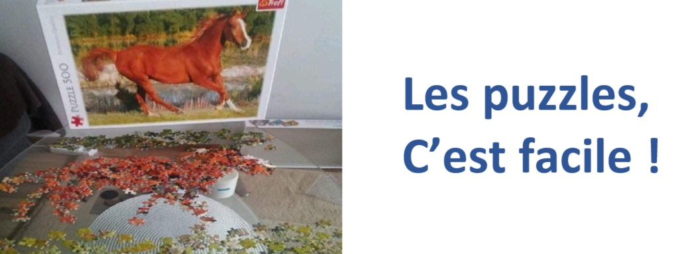

# SGRS 2019
Breaking through the SGRS 2019 Challenge - [lien](https://www.mil.be/fr/communiques-presse/les-enigmes-du-sgrs-sont-de-retour)

* [Questionnaire 2019 (français)](./doc/SGRS%202019.pdf)
* [Questionnaire 2019 (néerlandais)](./doc/SGRS%202019%20-%20NL.pdf)
* [Questionnaire 2018](./doc/SGRS%202018.pdf)
* [Questionnaire 2018 - solutions](./doc/SGRS%202018%20-%20Soluce.pdf)

## Avant propos

Bienvenue sur cette page qui a été, pendant trois intenses semaines, le centre névralgique grâce auquel nous avons pu participer au concours organisé par le SGRS en 2019. L'idée était de pouvoir traquer facilement le progrès effectué sur les différentes énigmes, tout en consignant nos différentes idées et tentatives, qu'elles aient été fructueuses ou pas.

Le but de ce projet GitHub n'est en aucun cas d'expliquer les solutions aux différentes énigmes du concours, nous laissons ce soin aux auteurs du puzzle. Au contraire, comme ce projet a été gelé peu après la remise de notre formulaire de participation, il reflète plutôt exactement jusqu'où nous avons pu progresser. Aussi ne se trouve ici que les résolutions des énigmes sur lesquelles nous avons pu avancer (et agrémentées d'erreurs éventuelles).

Le point de départ vient du tableau ci-dessous, qui reprend des liens vers différentes sous-pages - une par énigime - et qui permet en un coup d'oeil de voir le statut de chacune d'elles. Les liens permettent ensuite d'atterrir sur des explications plus détaillées, propres à chaque problème.

Certaines explications sont assez académiques, dans le sens où une brève analyse, suivie d'une résolution, se succèdent sans détour. Cela traduit simplement le fait que nous avons trouvé la solution de ces énigmes rapidement. Au contraire, certaines pages révèlent une intense dialectique, des idées plus ou moins concluantes ou des commentaires en tout genre, menant finalement à un dénouement, ou pas. Ces pages sont restées telles quelles et témoignent ainsi du chemin tortueux qui peut mener à une solution, ou sur lequel on peut se perdre. Enfin, certaines pages sont restées vides, lorsque nous n'avions pas même l'ombre d'une piste.

Sur 43 énigmes, un tiers environ ont été résolues en s'aidant de programmes informatiques ad hoc. Le langage Python est un langage de choix pour ce type d'exercice, car son environnement très riche, couplé à sa capacité d'exprimer rapidement des idées, autorise de tester beaucoup d'hypothèses. Bien sûr, en aucun cas un programme ne peut se substituer à la créativité et à la perspicacité hummaine, particulièrement indispensable ici. Mais il arme toutefois l'esprit, comme une épée prolonge la dextérité d'un bras, en systématisant et en décuplant sa rapidité d'exécution.

Avant de tourner définitivement la page de cette épopée, je tiens à remercier tous ceux qui m'ont accompagné dans cette aventure. Que ce soit par une participation intense pour certains, ou tout simplement pour m'avoir écouté ne parler que de ça pour d'autres, beaucoup de personnes ont contribué de près ou de loin au résultat final.

Pour finir, je ne voudrais pas oublier de remercier les auteurs de ce puzzle qui, part leur créativié, leur ingéniosité et certainement beaucoup de travail, nous ont concocté un superbe cadeau de Noël. Il est très rare que je trouve les questions d'un concours un temps soit peu intéressantes.

**Le véritable sage n'est pas celui qui répond aux questions, c'est celui qui les pose**.

### Hall of fame

* **Michaël Devuyst**, pour avoir découpé la figure, même si nous n'avons pas pu aller plus loin;
* **Olivier Delbeke**, pour m'avoir informé du concours, pour avoir fait tourner la machine et pour l'agencement des allumettes;
* **Jean-François Meessen**, pour avoir su assembler les pièces du puzzle clé et pour avoir trouvé l'astronaute;
* **Charles-Etienne Gonsette**, qui a su lire en sens inverse, trouver son chemin dans le triptyque, trouver son chemin vers l'Antarctique et déclarer sa flamme à Alice;
* Enfin, last but not least, **Baudouin Duchêne**, dont l'AZERTY et le binaire n'ont plus de secret pour lui, qui a trouvé l'arc-en-ciel, qui a appris à parler russe, qui a su interpréter les codes de la résistance, déchiffrer les journaux hostiles, rétablir la communication, interpréter le sens des flèches, faire tourner le phénakistiscope, trouvé la clé du puzzle, rassemblé le tableau de Mendeleïev, et j'en passe. Cela constitue un beau palmarès, mais l'histoire ne dit pas quelle part de mérite attribuer à son épouse **Elodie Niset** ;-)  

## Ressources utiles

1. Number theory: [Crazy numbers](https://www.crazy-numbers.com/)
2. Codage et annagrammes: [DCode](https://www.dcode.fr/), [anagrammeur](http://www.anagrammeur.com/anagrammeur.php)
3. Une description presque exhaustive de tout types de puzzles: [Cross+A](http://www.cross-plus-a.com)

## Astuces fréquentes auxquelles penser

1. Aller voir la [version néerlandaise](doc/SGRS%202019%20-%20NL.pdf) du questionnaire. Certains problèmes sont différents pour des raisons de langue. Ca donne de l'information.
2. Anagrammes, permutation de lettres
3. Chiffre de César, ou rotation / décalage de lettres
4. Chiffre de Vigenere, par clé
5. Rotation des lettres dans un mot
6. Les notes de musique
7. Les éléments du tableau périodique
8. Code couleur résistances
9. Jeux en général: Combat naval, Echec, Stratego
10. Codages tels que le [Braille](https://fr.wikipedia.org/wiki/Braille), le [Morse](https://fr.wikipedia.org/wiki/Code_Morse_international), les [Tap codes](https://fr.wikipedia.org/wiki/Tap_code), les [Sémaphores](https://fr.wikipedia.org/wiki/Alphabet_s%C3%A9maphore)

## Progrès
La table ci dessous permet d'avoir un aperçu rapide de l'état d'avancement. Des pointeurs mènent vers les pages où le détail des solutions trouvées est donné.

| Question | Thème | Statut | Nbr Points | Programme de résolution |
|----------|-------|--------|------------| ----------------------- |
| [1 - wiki](wiki/P01.md)  | Texte pointillé                       |  OK  | 1 |                      |
| [2 - wiki](wiki/P02.md)  | Machine                               |  OK  | 3 | [lien](code/P02_eke.py)  |
| [3 - wiki](wiki/P03.md)  | Qui et qui ?                          |  OK  | 3 |                      |
| [4 - wiki](wiki/P04.md)  | Allumettes                            |  OK  | 2 | [lien](code/P04.py)  |
| [5 - wiki](wiki/P05.md)  | Code alphanumérique                   |  OK  | 1 | [lien](code/P05.py)  |
| [6 - wiki](wiki/P06.md)  | Suites de lettres                     |  OK  | 4 |                      |
| [7 - wiki](wiki/P07.md)  | Arc-en-ciel                           |  OK  | 2 |                      |
| [8 - wiki](wiki/P08.md)  | Mots géométriques                     |  OK  | 3 |                      |
| [9 - wiki](wiki/P09.md)  | Suite de mots                         |  OK  | 1 |                      |
| [10 - wiki](wiki/P10.md) | **Figure à découper**                 | HELP | 2 |                      |
|[11 - wiki](wiki/P11.md)  | Nombres liés                          | OK   | 2 |                      |
| 12                       | **Série à compléter**                 |      | 1 |                      |
| 13                       | **Graphique erroné**                  |      | 2 |                      |
|[14 - wiki](wiki/P14.md)  | **Recherche d'animaux**               | idée | 5 |                      |
|[15 - wiki](wiki/P15.md)  | **Shikaku**                           | idée | 3 |                      |
|[16 - wiki](wiki/P16.md)  | Mots caché                            | OK   | 2 |                      |
|[17-a - wiki](wiki/P17.md)| Qu'est-il écrit ?                     | OK   | 2 |                      |
|[17-b - wiki](wiki/P17b.md)| Equation avec pays                   | OK   | 2 |                      |
|[18 - wiki](wiki/P18.md)  | Horloges                              | OK   | 3 |                      |
|[19 - wiki](wiki/P19.md)  | **Carte du monde**                    | idée | 3 |                      |
|[20 - wiki](wiki/P20.md)  | Phrase codée                          | OK   | 4 |                      |
| 21                       | **Pyramides de cubes**                |      | 2 |                      |
|[22a - wiki](wiki/P22A.md)| **Famille numérique**                 |      | 1 |                      |
|[22b - wiki](wiki/P22B.md)| **Pierres tombales**                  |A Valider| 2 |                      |
|[22c - wiki](wiki/P22C.md)| Mots cubiques                         |  OK  | 4 | [lien](code/P22c.py) |
|[22d - wiki](wiki/P22D.md)| Tours de cubes                        |  OK  | 3 | [lien](code/P22d.py) |
|[23 - wiki](wiki/P23.md)  | Roues fléchées                        |  OK  | 3 |                      |
|[24 - wiki](wiki/P24.md)  | Grille cryptée                        |  OK  | 3 |[lien](code/P24-Decode.py)|
|[25 - wiki](wiki/P25.md)  | Bingo écossais                        |  OK  | 4 |                      |
|[26 - wiki](wiki/P26.md)  | Un, twee, trois                       |  OK  | 3 | [lien](code/P26.py)  |
|[27 - wiki](wiki/P27.md)  | France télécom                        |  OK  | 2 |                      |
|[28 - wiki](wiki/P28.md)  | Décomposition de nombres              |  OK  | 4 | [lien](code/P28.py)  |
| 29                       | **Mots croisés codés**                |      | 2 |                      |
|[30 - wiki](wiki/P30.md)  | Triptyque **freudien**                | 2/4  | 4 |                      |
|[31 - wiki](wiki/P31.md)  | Suivez le guide                       |  OK  | 6 |[lien](code/P31.py)   |
|[32 - wiki](wiki/P32.md)  | Puzzle                                |  OK  | 3 |                      |
| 33                       | **Mots cachés codés**                 |      | 3 |                      |
|[34 - wiki](wiki/P34.md)  | Diamant                               |  OK  | 4 | [lien](code/P34.py)  |
|[35 - wiki](wiki/P35.md)  | Ruche                                 |  OK  | 2 |                      |
|[36 - wiki](wiki/P36.md)  | Roulette                              | OK     | 1 |                      |
|[37 - wiki](wiki/P37.md)  | **Galaxy**                            | HELP | 2 |                      |
|[38 - wiki](wiki/P38.md)  | Automate cellulaire                   |  OK  | 3 | [lien](code/P38.py)  |
|[39 - wiki](wiki/P39.md)  | Raiponce et ses tresses               |  OK  | 4 | [lien](code/P39.py)  |
|[40 - wiki](wiki/P40.md)  | Arbres numériques                     |  OK  | 4 |                      |
|[41 - wiki](wiki/P41.md)  | Image éclatée                         |  OK  | 2 | [lien](code/P41.py)  |
|[42 - wiki](wiki/P42.md)  | Question cachée                       |  OK  | 3 |                      |
|[43 - wiki](wiki/P43.md)  | **150 ans du tableau de Mendeleïev**  |      |25 |                      |
|[Rep - wiki](wiki/Reponse.md)| **Reponse Enigme**  |      | |                      |

## Pour finir
Une petite touche d'humour de circonstance.

