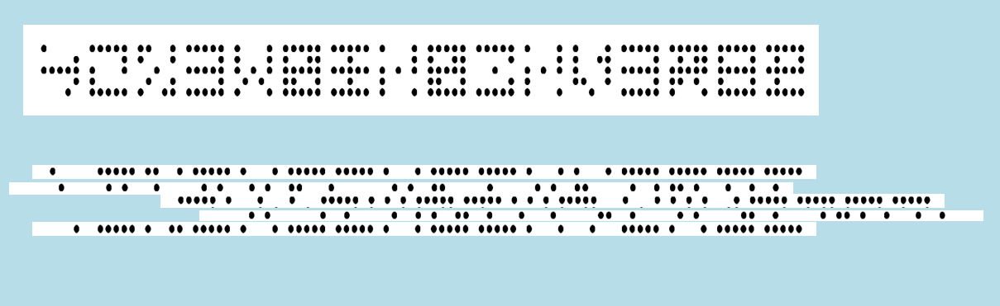
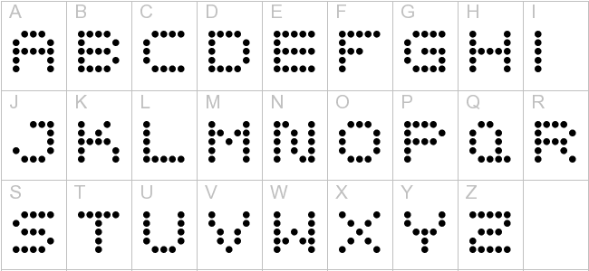

## Tâche 1

Vu que ce n'est que la 1ere tâche et qu'elle ne vaut qu'1 point, je me dis que ça doit être assez simple et basique comme épreuve.
Je me demande s'il ne suffit pas de diviser le texte en 5 segments horizontaux et de faire translater chaque segment de telle manière à trouver un texte cohérent.

# Hypotheses:
* les lettres sont larges de 5 digits;
* les translations se font en multiple de 6 digits (pas comme sur la photo exemple ou j ai recomposé un **"X"**)

@JSG: tu peux nous programmer ca et ne resortir que les sequences qui donnent des lettres plausibles ??

JSG: je mets ça dans ma todo liste, en attendantn, voici déjà une image indiquant comment faire des lettres

commentaires Gonz
* en partant sur l'hypothese de baudouin:
** il n'y a pas de 'A' (la succession de 3 point n'apparait nul part)
*** les lignes sont melangées et les lettres sont mirroires (cfr 2eme et 3eme ligne characteristique du "N")

--》il faut chercher a reconstituer les "N" pour remettre de l'ordre
--》 la 3eme en partant de la fin et derniere sortent du patern donne par js

