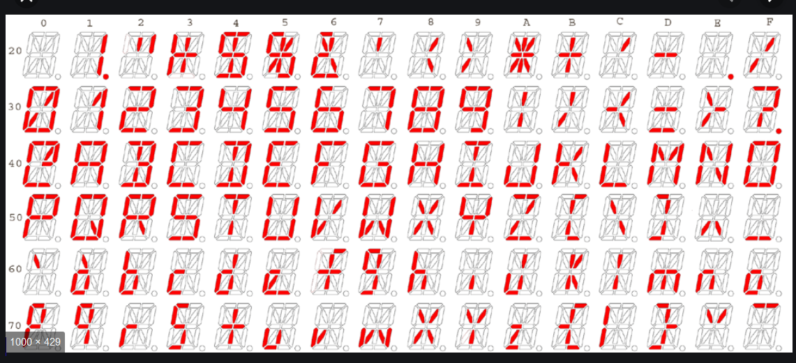

# Tâche 5

Le code suivant est le résultat d'une opération de 2 séries, lesquelles ?

## Analyse

Les exemples indiquent que l'opération s'effectue sur chaque digit séparément, en combinant les différents segments entre eux. Chaque digit possède 6 segments horizontaux, 6 segments verticaux, ainsi que 4 segments diagonaux.


On peut se douter que l'opération de mélange des segments reste simple, mais encore faut-il trouver la bonne. Un XOR entre les segments ne fonctionne pas tel quel. Comme il y a peu d'exemples incluant les diagonales, c'est un bon point de départ. On peut alors remarquer que:

1. La barre du R dans R+O s'inverse par rapport à l'axe vertical
2. le \\/ dans le M de U+M vient faire la pointe du triangle, par rotation ou par symétrie d'axe horizontal.

On peut alors trouver facilement l'opération de mélange qui consiste à réaliser **un XOR segment par segment, sur la symétrie horizontale du chiffre de gauche et sur la symétrie verticale du chiffre de droite**.


## Resolution



Le nombre de combinaisons de digits d'un tel afficheur est très limité, ce qui rend possible d'essayer toutes les combinaisons de paires rapidement. C'est ce que réalise [ce programme](./../code/P05.py). Il part d'une liste de tous les caractères probables, applique la transformation sur toutes les paires possibles, puis affiche les paires initiales possibles pour chaque digit codé.

**Attention** que certains caractères peuvent s'encoder de plusieurs façons, il faut y être attentif. Voici le résultat obtenu:

```IA/TH
HH/II/MW/NN/OO/SS/WM/XX/ZZ/  /--/00/22
L /OL/TD
EH/FA/ E
CI/DO/LT
LH
IE
No combination found
BE/CD/DC/EB
NE
CS/2C
BA/ET
QO
DT/LO/ L
AI/HT
LN
WE
A /EF/-U
YO
GP/SF
HH/II/MW/NN/OO/SS/WM/XX/ZZ/  /--/00/22
L /OL/TD
AF/E /HE
A /EF/-U
EH/FA/ E
FN
IS/SI
RE
 2/2
CT/LI/T!
```

Ce n'est pas encore tout à fait ça et ce n'est pas évident d'extraire les deux phrases de départ. En regardant le problème dans la version néerlandaise, on se rend compte que le problème est exactement le même. Cela laisse supposer que le texte n'est ni en français ni en néerlandais, mais plutôt en anglais.

En cherchant un peu, voici la meilleure solution partielle:

```
I N T E L L I G E N C E ?   A L W A Y S   T H E   F I R S T

A N D   T H E   B E S T   L I N E   O F   D E F E N S E   !
```

Cette solution coince sur 4 positions, mais après avoir posé la question aux auteurs, ils m'ont confirmé que cette question était un peu buggée et que cette réponse était valide.
