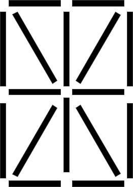

# Tâche 5

Le code suivant est le résultat d'une opération de 2 séries, lesquelles ?

## Analyse

Les exemples indiquent que l'opération s'effectue sur chaque digit spérarément, en combinant les différents segments entre eux. Chaque digit possède 6 segments horizontaux, 6 segments verticaux, ainsi que 4 segments diagonaux.

On peut se douter que l'opération de mélange des segments reste simple, mais encore faut il trouver la bonne. Un XOR entre les segments ne fonctionne pas tel quel. Comme il y a peu d'exemples incluant les diagonales, c'est un bon point de départ. On peut alors remarquer que:

1. La barre du R dans R+O s'inverse par rapport à l'axe vertical
2. le \\/ dans le M de U+M vient faire la pointe du triangle, par rotation ou par symétrie d'axe horizontal.

On peut alors trouver facilement l'opération de mélange qui consiste à réaliser **un XOR segment par segment, sur la symétrie horizontale du chiffre de gauche et sur la symétrie verticale du chiffre de droite**.
