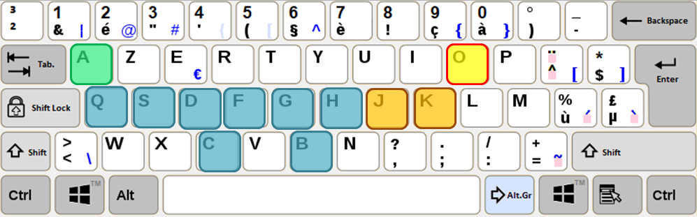
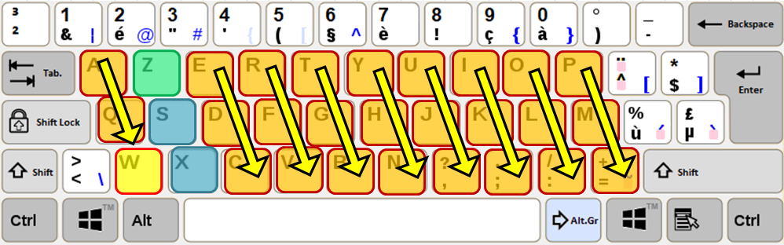

# Tâche 6

Quel est le dernier caractère de ces suites finies ?

## Analyse

(1) a. A, Q, S, D, C, F, G, B, H, . . ., *J*, *K*, **O**

J'ai d'abord remarqué que la 4eme lettre est systématiquement dans le bonne ordre alphabétique, mais je n'ai pas pu conclure...
J'ai ensuite comparé l'ordre des touches sur les claviers Azerty, Qwerty, Dworak, Colemak et Bepo mais sans succès.
La meilleure proposition serait de tracer un pattern sur le clavier Azerty belge.

(1) b. Z, S, X, . . ., *A*, *Q*, **W**

Cela fait penser aux lettres du clavier AZERTY sélectionnées de haut en bas en commençant par la 2eme colonne. il est difficile de déterminer le dernier caractère à la droite du clavier, c est sans doute pour cela que la suite commence avec la 2e colonne.
J'en déduis donc que les 3 derniers caractères sont A, Q, W. Avec peu de certitude je dirais que la réponse est "W"

(1) c. W, T, E, D, C, F, G, H, . . .

(1) d. 1, 5, 3, 3, 3, 4, 5, 6, 8, 7, 8, 9, . . .

### gonz
je pensais faire des lettres avec un clavier de telephone, mais ca ne donne rien de clair. saus si il y a un codage en plus qui m'aurait echappé

NB: l'énoncé en néerlandais est identique, il n'est donc pas question de composer des mots en français pour compléter la suite. 
