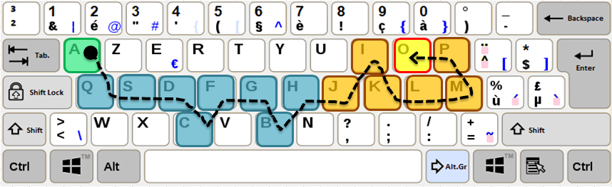

# Tâche 6

Quel est le dernier caractère de ces suites finies ?

## Analyse

**gonz:/**
je pensais faire des lettres avec un clavier de telephone, mais ca ne donne rien de clair. saus si il y a un codage en plus qui m'aurait echappé

NB: l'énoncé en néerlandais est identique, il n'est donc pas question de composer des mots en français pour compléter la suite.

### Série a) A, Q, S, D, C, F, G, B, H, . . .

J'ai d'abord remarqué que la 4eme lettre est systématiquement dans le bonne ordre alphabétique, mais je n'ai pas pu conclure...
J'ai ensuite comparé l'ordre des touches sur les claviers Azerty, Qwerty, Dworak, Colemak et Bepo mais sans succès.
La meilleure proposition serait de tracer un pattern sur le clavier Azerty belge.

Néanmoins très peu probable car il y a plusieurs possibilité de pattern symmetriques....
Mais je suis très confiant que ca ait un rapport avec le clavier, ce n est pas 1 hazard que les lettres suivent autant la logique de disposition AZERTY.
Je me suis dit que ça pouvait suivre un logique de type: 
- Sélectionner le plus petit caractère d'une touche voisine 
- Ne pas sélectionner 2 fois la même touche.
Il faut par contre ne considérer que les lettres car si l'on prend en compte tous les caractères en ordre ASCI les valeurs pour "1" et "2" sont plus faible que "Q" et pourtant voisines de "A".

Cela nous donne donc la suite finie AQSDCFGBHJIKLMPO

### Série b) Z, S, X, . . ., A, Q, **W**

Cela fait penser aux lettres du clavier AZERTY sélectionnées de haut en bas en commençant par la 2eme colonne. il est difficile de déterminer le dernier caractère à la droite du clavier, c est sans doute pour cela que la suite commence avec la 2e colonne.
J'en déduis donc que les 3 derniers caractères sont A, Q, W. Avec peu de certitude je dirais que la réponse est "W". En espérant qu'il ne faille pas s'arrêter à PM**§**

Cela donne la série de 30 caractères suivante: ZSXEDCRFVTGBYHNUJ?IK.OL/PM§AQW

### Série c) W, T, E, D, C, F, G, H, . . .

LA LOGIQUE SERAIT LA SUIVANTE:
Tâchons d'écrire l'alphabet classique mais avec une subtilité bien evidemment.
Postulats:
- Utilisation d'un clavier AZERTY
- Si la lettre à coder est sur la rangée du milieu alors elle ne subit aucun cryptage
- Si la lettre est sur la range du haut, il faut la remplacer par celle de la rangée du bat sur la meme colonne
- Même cryptage en inversant Haut et Bas

Vérification:
A=>W ; B=>T ; C=>E ; D=>D ; E=>C ; F=>F; G=>G ; etc...

Cela donnerait la serie suivante de 26 caractères: WTEDCFGH.JKLMY/§QVSB?RAZNX

### Série d) 1, 5, 3, 3, 3, 4, 5, 6, 8, 7, 8, 9, . . .

Comme plusieurs chiffres apparaissent plusieurs fois, je suis d'abord parti sur l'idée de les regrouper par 2 ou 3, sans que rien d'évident ne se manifeste. Puis, en m'inspirant des réponses précédentes de Baudouin et en *énumérant l'alphabet*, je me suis rendu compte qu'il suffit de prendre le numéro de colonne de chaque lettre, dans l'ordre.

La dernière lettre, le **Z** se trouve donc dans la **2eme colonne**. A noter que cette même lettre se trouve sur la première colonne sur un clavier QWERTY, et qu'il aurait fallu un chiffre de plus dans la question pour discriminer les deux cas.

 
