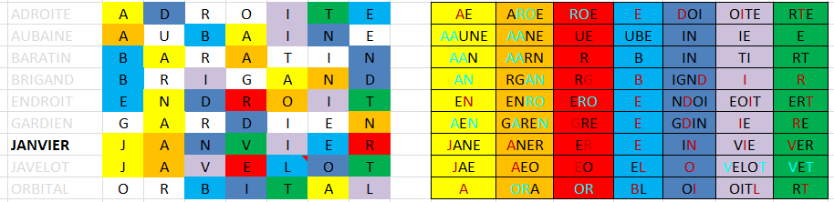

# Tâche 7

Chaque mot de cette liste sauf un aurait pu être écrit avec des couleurs à d’autres endroits.
Pour quel mot dans cette liste cela ne fonctionne pas?

## Observations:
* chaque mot est composé de 7 lettres
* chaque mot est composé des 7 couleurs: *Rouge*, *Vert*, *Bleu*, *Jaune*, *Orange*, *Violet* et une couleur entre bleu et violet que nous nommerons *Mauve* pour l'instant.
* chaque suite de lettre commune a plusieurs mots a le même ordre de couleur: JA, GA, DROIT,...
* L'observation précédente ne s'applique pas quand 2 paires (de lettre commune à 2 mots) se chevauchent: *GA* et *AR* dans *GARdien* ce qui me fait adopter une tactique différente
* groupons toutes les lettres d'une même couleur:
  * *Orange*: A,A,A,O,A,A,A,R
  * *Rouge*: U,R,G,R,G,R,E,O
  * *Bleu*: B,B,B,E,E,E,L,B
  * *Jaune*: A,A,N,N,N,J,J,A
  * *Violet*: I,I,I,I,I,I,T,L
  * *Mauve*: N,N,D,D,D,N,O,I
  * *Vert*: E,T,R,T,R,V,V,T
  
  L'oeil avisé remarquera que les lettres composent en fait le nom de leur couleur
  
  * **ORA**nge: A,A,A,O,A,A,A,R
  * **ROUGE**: U,R,G,R,G,R,E,O
  * **BLE**u: B,B,B,E,E,E,L,B
  * **JA**u**N**e: A,A,N,N,N,J,J,A
  * v**i**o**L**e**T**: I,I,I,I,I,I,T,L
  * Mauve: N,N,D,D,D,N,O,I
  * **VERT**: E,T,R,T,R,V,V,T 

## Resolution

* Après réflexion la couleur mauve est en fait de *l'INDIGO*.

* Essayons maintenant de trouver quel mot ne peut avoir ses couleurs changées. Pour cela commençons par lister quelles couleurs peuvent être appliquées à chacune des lettres de l'énoncé:
  * J: **J**aune
  * B: **B**leu
  * D: in**d**igo
  * A: J**a**une / Or**a**nge
  * L: B**l**eu / Vio**l**et
  * T: Viole**t** / Ver**t**
  * V: Viole**t** / Ver**t**
  * I: V**i**olet / **I**ndigo 
  * R: **R**ouge / O**r**ange / Ve**r**t
  * G: Oran**g**e / Rou**g**e / Indi**g**o
  * N: Ora**n**ge / Jau**n**e / I**n**digo
  * U: Ro**u**ge/ Ble**u** / Ja**u**ne
  * O: **O**range / R**o**uge / Vi**o**let / Indig**o**
  * E: Orang**e** / Roug**e** / Bl**e**u / Jaun**e** / Viol**e**t / V**e**rt

Il y a à présent moyen d'identifier les mots qui peuvent s'écrire avec plusieurs combinaisons de couleurs. On peut commencer à éliminer les mots contenant 2 mêmes lettres: *BARATIN* et *AUBAINE* car les *A* peuvent être *Jaune* ou *Orange*.
En procédant ensuite par élimination , on en déduit que ***JANVIER*** est le mot au coloris unique.
  


En Cyan les lettres qui peuvent changer de couleur, en bordeaux celles qui ne peuvent pas.

## NB: 
* il y a moyen d'écrire une multitude d'éléments chimique avec les lettres composant les 9 mots de l'énoncé.

```
RADON
ETAIN
BORE
IODE
ARGON
ARGENT
OR
TELlURe
TANtaLE
NEOn
TItANE
```

* Dans l'énoncé, le mot "bara*tin*" contient le mot ***TIN*** qui n'est autre que la traduction anglaise de l'élément chimique de numéro atomique 50.
