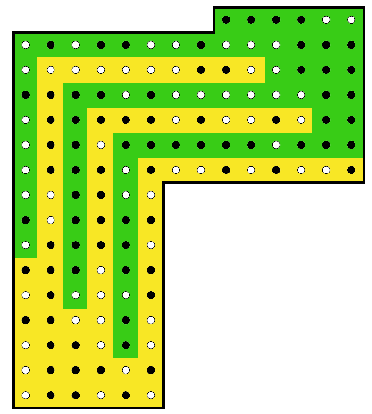

# Tâche 10

Divisez la figure suivante en deux parties identiques en coupant une seule fois.


## Découpe de la figure

Un tout grand merci à Michael Devuyst pour avoir trouvé cette magnifique découpe:



Reste à trouver comment combiner le tout et comprendre ce qui se cache derrière les boules.

## Se qui se cache derrière

### Idée du masque

Superposer le patern obtenu au tableau de Mendeliev, au texte de la question, à une page particulière ? J'essaye plusieurs combinaisons sans succès pour le moment.

Mais ça ne donne rien pour le moment

### Transformation en binaire

J'ai essayé de recombiner les deux pièces de deux façons. Chaque fois je "déplie" les dents du peignes pour en faire une superposition de lignes. Par exemple, la première pièce est celle-ci, en considérant arbitrairement que le blanc vaut 1:

```
piece_0 = [
    '110000',
    '0001110110010110111101',
    '0001',
    '00111111010000000001',
    '00',
    '000100000011000100']
```

En insérant une pièce dans l'autre, on obtient le rectangle suivant:

```
1 1 0 0 0 0 0 1 1 0 1 0 1 1 0 1 0 1 0 0 1 1 0 1
0 0 0 1 1 1 0 1 1 0 0 1 0 1 1 0 1 1 1 1 0 1 1 0
0 0 0 1 1 0 1 1 0 1 0 0 0 1 0 0 0 0 1 1 1 1 0 1
0 0 1 1 1 1 1 1 0 1 0 0 0 0 0 0 0 0 0 1 1 0 0 0
0 0 1 0 0 1 1 1 1 1 1 0 0 0 0 1 1 0 0 0 0 0 0 0
0 0 0 1 0 0 0 0 0 0 1 1 0 0 0 1 0 0 0 1 0 1 1 1
```

On peut aussi les superposer, et on obtient alors ceci, en notant par un '.' chaque bit ou la valeur est différente:

```
11.0.0
000...01100.011.111.01
0001
.01111..0..000.0..01
0.
.0.100.0.0110.01.0
```


