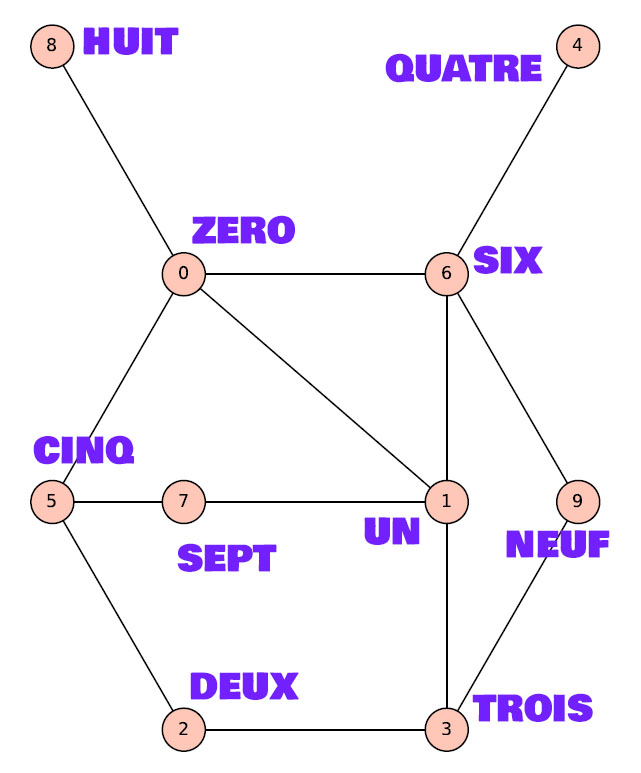

# Tâche 11

Si nous voulons ajouter 10^9 au diagramme suivant, avec quels chiffres y aura-t-il une connexion?

## Analyse

Encore une fois, la consultation du questionnaire en néerlandais est révélatrice, car le graphe y est bien différent. Nous pouvons donc partir du principe que l'orthographe des mots est importante. Ecrivons-les donc:

Quel est le point commun entre les nombres reliés ? La réponse c'est qu'il n'ont rien en commun, dans le sens où les lettres qui les composent sont toutes différentes.

## Solution

10^9, *milliard* en toutes lettres, n'a pas de lettres communes avec **un**, **sept** et **neuf**.

