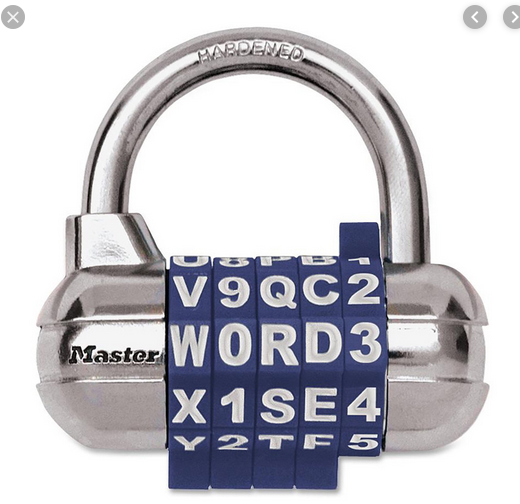

Enoncé en Francais:

T H V M M C S G R 1 F 2 5 X P L Y R 1 N 

H 6 F J I 1 C K 4 A F L **U N E** M 2 V I 6 

B 2 I N P P U J 7 Y A O V I B W A D 3 Q 

8 3 F 2 J P S E S P U D P 7 M C 4 C S Y 

N V S O - 8 - I Y 4 Y G X F J **5** 2 **N S** ?

Enoncé en Néerlandais:

T T F L C C U B I O T G N 1 J F 1 A F R 

S 1 A V 0 D B 6 F W 9 E T N E 6 X 6 L G 

G 6 V V E J G S 5 J Y 2 8 1 L Y D W T V 

U O F V U P K 1 R T P O S V Z E 9 B N K 

1 F J S 2 F I J C N G 6 2 B 5 **J** X **A R** ?

le dernier mot serait-il "5 ans?" ??

Hypothèses: 
* les lettres/chiffres qui n'ont pas de flèche ne subiraient aucun changement...

* Je me demandais si les doubles flèches ne voulaient pas dire de prendre le nombre opposé en base 36.

* La flèche vers le haut, on prendrait 1 lettre entre 1 et 12 échelons vers le haut. 

* La flèche vers le bas, on prendrait 1 lettre entre 1 et 12 échelons vers le bas. 

Malheureusement ça n'a pas donné quelque chose de concluant, dommage... 

Sinon les mêmes lettres et chiffres apparaissent 2-3 fois, peut-être 1 piste à creuser. 

Erratum à considérer: **Pour ceux qui ont déjà entrepris quelques étapes : il peut y avoir un manque de clarté. Nous comptons en années, pas en mois.**

**Idée JS:** Pourrait-il y avoir un lien avec ceci ? Est-ce normalisé le contenu de ce genre de cadenas ?

