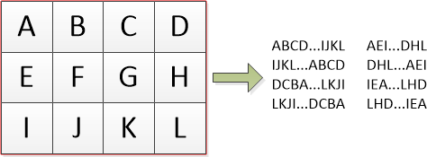

# Tâche 15
Des animaux sont cachés dans le *shikaku* ci-dessous.

**Gonz:/**
## Idée
Si on lance une cryptanalyse de Vigenère sur une portion de texte, on tombe toujours sur une longueur de clé de 2 charactères. Je m'avance peut être, mais le chiffre dans le rectangle pourrait correspondre au numéro atomique d'un élément, servant de clé pour ce rectangle (Autour des palombes aurait été codé sur base de "AR").

J'ai un peu essayé avec des carrés de taille probable (AR18 / SI14 / CA20 / CR24 / NA11 / NE10 / MG12 / BE4 / FE26 / AL13, etc..) mais si l'on rajoute la probabilité d'avoir des rotations, cela devient vite difficile à faire à la main.

Est ce que tu pourrais programmer ca ?


**JS:/**
## Tentative

Pour cette tâche, j'ai écrit un [programme](./../code/P15.py) qui réalise les opérations suivantes:

1. Pour chaque case jaune, une fonction extrait tous les rectangles qu'il est possible de placer dessus, sans empiéter sur une autre case jaune;
2. Pour chaque rectangle, le contenu de la grille est lu de différentes manières (voir dessin);



3. Pour toutes les phrases extraites d'un rectangle, celles-ci sont décodées en utilisant Vigenere (dans un sens ou dans l'autre), et pour toutes les clés dans un ensemble pré-déterminé;
4. Chaque résultat est examiné pour savoir s'il fait partie de l'un des [1700 animaux de cette liste](./../code/Animaux.txt) (et oui, même AUTOUR DES PALOMBES s'y trouve).


L'ensemble de clés utilisé consiste en 
* toutes les lettres de l'alphabet (ce qui devient alors équivalent à du César);
* tout le contenu du tableau de Mendeleiev, ainsi que chaque élément en abrégé sur 2 lettres;
* tous les animaux du dictionnaire cité plus haut;

Cela donne un très large éventail de possibilités testées.

Voici le maigre résultat trouvé:

```
Test around 1, 8
ISARD from HB-GGP with key BRULOT
GOELAND from R-GPDIUM with key PIPISTRELLE

Test around 2, 4
TIGRE from F-KGIM with key MACARIA
VISON from GIF-IE with key LANGURACAPUCHON
MULET from K-FEEI with key CEPHALOPHEADOSJAUNE
Test around 4, 2
GRIVE from B-RVII with key VANNEAUHUPPE

Test around 4, 8
DINGO from -HBEGG with key TETRASDUCANADA
GREBE from ED-TQE with key COLLADONUSCLITELLARIUS

Test around 7, 3
NYALA from BG-EOE with key OIEDEROSS
RATEL from G-OESY with key POLONIUM
CHIEN from G-SIXR with key ELATERIDES
ISARD from EB-SXR with key ERBIUM
GRIVE from SRS-XE with key MAKICATTA

Test around 7, 7
MULOT from MDFAG- with key ARGON
MULET from MDFAG- with key ARGENT
CHAUS from -PESAG with key INDIUM
ELAND from -PESAG with key SPHINXCOLIBRI

Test around 8, 1
CALAO from C-YSSB with key ACTINIUM
FURET from QGY-EB with key POTASSIUM
RENNE from GQ-YBE with key LOUPMARIN

Test around 10, 9
RATEL from MA-GID with key VANESSEDUCHARDON

Test around 12, 5
FOSSA from UABK-H with key LORIOT

Test around 15, 4

Test around 15, 7
TIGRE from U-MITV with key BECCROISEBIFASCIE
MORIO from -UMRRI with key ESCARGOT
CESAR from RMU-IT with key PIC
AIGLE from U-ITIA with key GRANDEAIGRETTE

Test around 16, 0
```