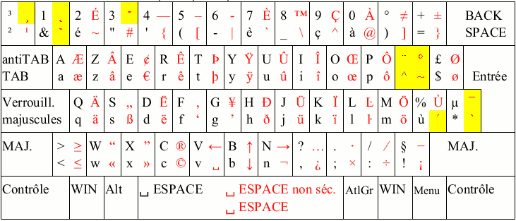
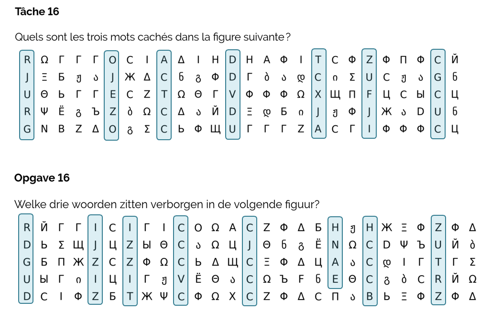
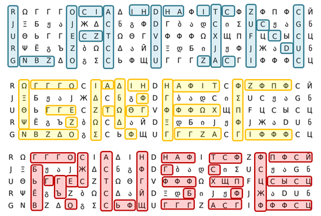

# Tâche 16

Quels sont les trois mots cachés dans la figure suivante ?

## Analyse

C'est un mélange d'alphabets *cyrillique*, *grec* et *géorgien*. Il m'a fallu plus d'une heure juste pour produire ceci:

```
grid = ['ꓣ Ω Г Г Г О С І А Δ І Н D Н А Ф І Τ С Ф ꓜ Ф П Ф С Й',
        'Ј Ξ Б ჟ Ა Ј Ж Δ С б გ Ф D Г Ბ Ა დ С Ი Σ ꓴ С ჟ Ა G б',
        'ꓴ Θ Ь Г Г Е С ꓜ Τ Ω Θ Г ꓦ Ф Ф Ф Ω Χ Щ П F Ц С Ы С Ц',
        'ꓣ Ψ Ё გ Ъ ꓜ Ბ Ω С Δ Ა Й D Ξ დ Б Ი Ј ჟ Ф Ј Ж Ა D ꓴ б',
        'G N В ꓜ Δ О გ Σ С Ь Ф Щ ꓴ Г Г Г ꓜ А С Г І Ф Ф Ф С Ц']
```

Mais je ne suis même pas sûr que ce soit correct, car parfois certaines lettres se retrouvent dans plusieurs alphabets, s'affichent de la même façon, mais ont un encodage sous-jacent différent. Il y a aussi des lettres, comme le **D**, que je n'ai trouvé que dans l'alphabet *latin*.

Bref, c'est pas gagné ...

**/Baudouin:**

Je me suis dit au début que c'etait peut-être une transposition clavier un peu comme la photo ci-jointe, mais si ça mélange plusieurs alphabet, c'est pas gagné comme tu écris...




En y regardant sous un autre angle, je trouve remarquable que l'on puisse grouper des ensembles de lettres latines par colonne complète, et cela dans les 2 versions.




A noter qu'il y a 1 colonne de plus dans le texte néerlandais.

2 heures plus tard, voici la solution:



## PS:
Soit dit en passant le mot **TIN** apparait dans LATIN... il est décidément partout celui-là.
