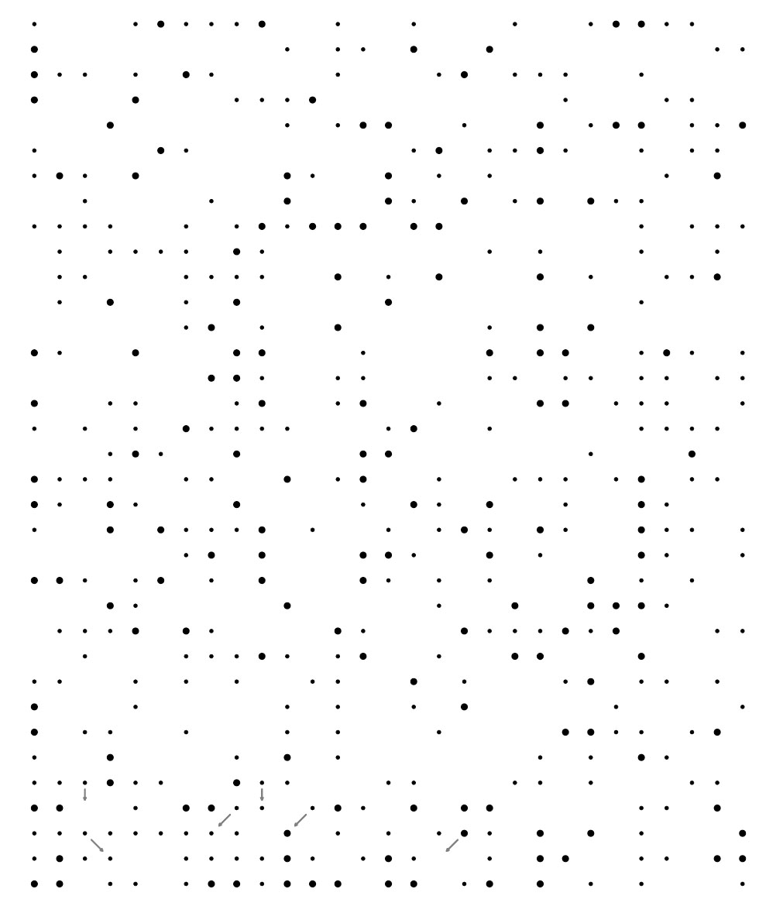

# Tâche 17-a

Qu’est-ce qui est écrit ici ?

## Analyse

Je ne sais pas si c'est une bonne idée, mais on peut toujours tenter de séparer les couleurs, comme ci-dessous avec le gris.

* [Flèches grises](17-Grey.jpg)
* [Flèches bleues](17-Blue.jpg)
* [Flèches rouges](17-Red.jpg)
* [Flèches vertes](17-Green.jpg)
* [Flèches jaunes](17-Yellow.jpg)
* [Flèches oranges](17-Orange.jpg)
* [Flèches brunes](17-Brown.jpg)
* [Flèches roses](17-Pink.jpg)

Peut-être y a-t'il une lettre à trouver par couleur ?

