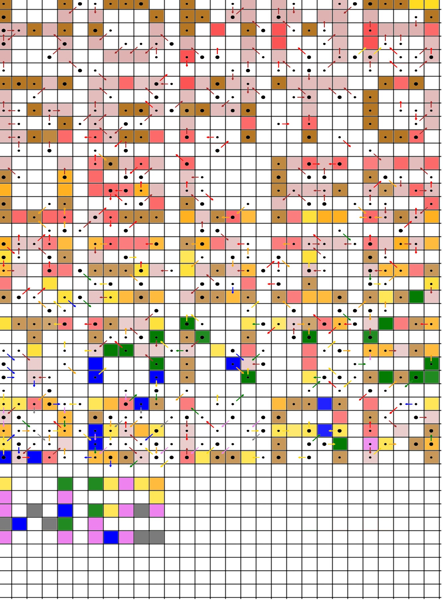

# Tâche 17-a

Qu’est-ce qui est écrit ici ?

## Analyse

Je ne sais pas si c'est une bonne idée, mais on peut toujours tenter de séparer les couleurs, comme ci-dessous avec le gris.


* [Flèches grises](17-Grey.jpg)
* [Flèches bleues](17-Blue.jpg)
* [Flèches rouges](17-Red.jpg)
* [Flèches vertes](17-Green.jpg)
* [Flèches jaunes](17-Yellow.jpg)
* [Flèches oranges](17-Orange.jpg)
* [Flèches brunes](17-Brown.jpg)
* [Flèches roses](17-Pink.jpg)

Peut-être y a-t'il une lettre à trouver par couleur ?

**/Baudouin**
Moi ça me fait penser à 1 QR code 29x29 en base 18 (9 orientations de flèche X 2 types de points) 
Fausse bonne idée ?) - mauvaise idée vu qu'il y a 41 lignes x 29 colonnes.

**/Gonz**
je pense qu'il suffit de déplacer les points en suivant les flèches, pour faire apparaitre un message. peut être qu'il y aura un interêt de les colorer 

**/Baudouin**
Observations (valable en version néerlandaise aussi):
- il n'y a pas plus d'une flèche partant d'un même point
- plusieurs flèches (même d'une même couleur) peuvent pointer vers le même point
- une flèche part toujours d'un point (petit ou gros)
- sur la dernière ligne, des flèches sortent de la zone uniquement par le bas
- il n y a jamais de flèche sortant de la zone sur les bords latéraux. C'est étonnant, car statistiquement il devrait avoir des flèches pointant hors zone sur les côtés. Ca devrait nous aider à trouver la logique...
- il n y a jamais 2 flèches adjacentes qui pointent l'une vers l'autre.
- **Il  est remarquable que les lignes 6, 12, 18, 24 et 30 (sur 35 lignes pour le Français) aient toutes leurs points comme base d'une flèche. 6, 12, 18, 24, 30, 36 pr le néerlandais (41 lignes au total) . Ce n'est pas un hazard !**

Voici l'énigme supperposée à une grille de 2 manières différentes, ça peut aider a observer une logique pour certain, qui sait...


J'ai tenté la logique de colorier la case pointée par une flèche de la couleur de la flèche elle-même en considérant que la flèche dont la base est 1 gros point l'emporte sur la flèche dont la base est un petit point. Mais j'ai arrêté après 6 lignes, car ça ne donne rien...

J'ai quand même décidé de lancer mes dernières forces dans la bataille et juste avant de déclarer forfait j'ai vu apparaitre un symbole au demeurant fort symétrique !!! Peut être un joli O...?


D'autres lettres ont suivi naturellement en suivant la règle suivante:
* point sans flèche = colorier la case du point
* point avec flèche brune = colorier la case voisine indiquée par la flèche
* point avec flèche rouge = colorier la case voisine+1 indiquée par la flèche
* point avec flèche orange = colorier la case voisine+2 indiquée par la flèche
* point avec flèche jaune = colorier la case voisine+3 indiquée par la flèche
* point avec flèche verte = colorier la case voisine+4 indiquée par la flèche
* point avec flèche bleue = colorier la case voisine+5 indiquée par la flèche
* point avec flèche rose = colorier la case voisine+6 indiquée par la flèche
* point avec flèche gris = colorier la case voisine+7 indiquée par la flèche

**Remarque**, ce codage du nombre de pas par couleur correspond exactement [au code couleur des résistances](https://fr.wikipedia.org/wiki/CEI_60757), tout comme pour la question [17-b](P17b.md). Un bel hommage à la *résistance*, comme on peut le découvrir sur la réponse ci-dessous.




**HOMMAGE A TOUS LES RESISTANTS DE LA WW2**

```
HOMMA
GEATO
USLES
RESIS
TANTS
DELAW
W2
```

## Eléments cachés du tableau de Mendeleïev

La taille des points n'a pas été utilisée pour répondre à cette question, ce qui veut dire que cela correspond à autre chose. On peut tout de suite penser à un alphabet [bilitère](https://www.apprendre-en-ligne.net/crypto/stegano/bilitere.html), un petit ou gros point correspondant à un code binaire.

Il s'avère que cette hypothèse est gagnante. Si nous prenons les 55 premiers caractères, nous pouvons trouver le mot **EINSTEINIUM**, soit le **99**ème élément du tableau périodique.

```
'00100 01000 01100 10001 10010 00100 01000 01100 01000 10011 01011'
```

Ce codage fonctionne toujours pour les 35 bits suivants, et nous obtenons alors le **FERMIUM**, le **100**ème élément.

```
'00101 00100 10000 01011 01000 10011 01011'
```

Malheureusement, ce n'est pas aussi facile pour la suite. Le décodage de ce qui suit ne donne rien, que l'on interprète en **Bacon**, **ASCII** ou **Base64**.

```
00000 00010 11111 00000 00001 00000 00000 01011 00010 ... 
```

Il est intéressant de noter que la version néerlandaise commence aussi par ces mêmes éléments chimiques, mais que la suite est différente:

```
00100 01000 01100 10001 10010 00100 01000 01100 01000 ...
```

Etant donné que la règle spécifie bien que, lorsque l'on trouve plusieurs éléments chimiques dans la même question, seul le premier rapporte des points, nous pouvons nous demander pourquoi deux éléments sont fournis.

La seule réponse plausible serait que ces deux éléments soient nécessaires pour décoder ce qui suit. Comme ce sont respectivement les numéros 99 et 100, la clé résiderait peut-être dans l'élément 101 suivant, le **MENDELEVIUM**.

Voici alors les clés qui me viennent en tête:
* MENDELEVIUM
* MD
* MENDELEIEV
* DIMITRI
* DMITRI
* BORE (101 = 5 en binaire et c'est le 5e élément)
* BORON
* 101 (comme masque binaire)
* E (le 101ème caractère ASCII)

J'ai essayé de les combiner par *XOR* avec la chaine à décoder et d'en interpréter le résultat en *Bacon*, *ASCII* et *Base64*, mais sans résultat. Une recherche un peu plus poussée sur base d'un dictionnaire ne donne rien non plus.

