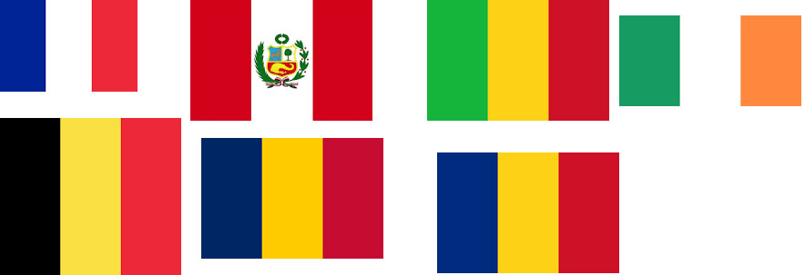

# Tâche 17-b

Quel pays sera remplacé par X dans l’équation suivante

## Idées (qui ne fonctionnent pas)

|                     | France | Mali   | Pérou  | Belgique | Tchad | Roumanie | Irlande | X |
| ------------------- | ------ | ------ | ------ | ------ | ------ | ------ | ------ | ------ |
| Préfixe téléphonique| 33     | 223    | 51     | 32     | 235    | 40     | 353    |        |
| Superficie          |        |        |        |        |        |        |        |        |
| Nb pays limitrophes |        |        |        |        |        |        |        |        |
| Coo GPS capitale    |        |        |        |        |        |        |        |        |
| Code ISO numérique  | 250    | 466    | 604    | 56     | 148    | 642    | 372    |        |
| Code ISO 3166       | FR     | ML     | PE     | BE     | TD     | RO     | IE     |        |
|                     |        |        |        |        |        |        |        |        |

## Autres idées

et puis j'ai eu une d'idée. En cherchant ce qui était unique à un pays, je me demande encore pourquoi je n'ai pas pensé tout de suite au drapeau. Mais un drapeau ca peut avoir plein de formes qui ne se prêtent pas trop à une mise en équation. Sauf que, regardons un peu les drapeaux des pays qui nous intéressent:

J'ai du mal à croire que ce soit un hasard tout ce bel assortiement de 3 rayures verticales.

Je ne sais pas encore comment arranger tout ça mais c'est peut être le bon bout. Surout que le Tchad et la Roumanie sont les deux seuls pays à avoir le même drapeau !

