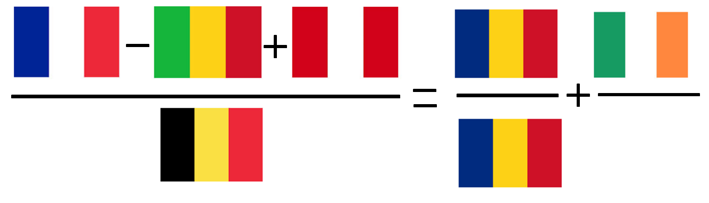
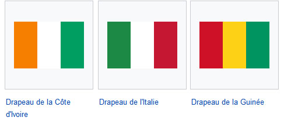
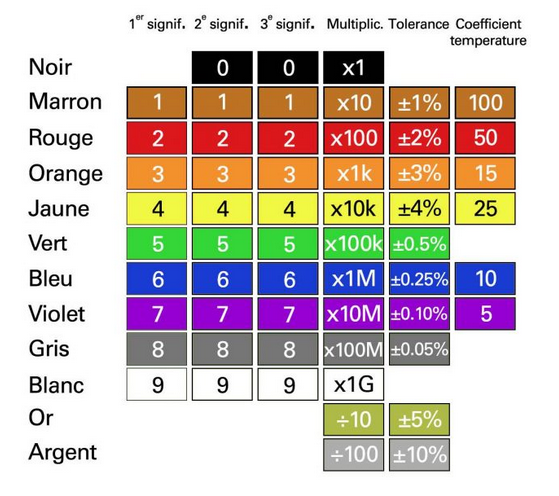

# Tâche 17-b

Quel pays sera remplacé par X dans l’équation suivante

## Idées (qui ne fonctionnent pas)

|                     | France | Mali   | Pérou  | Belgique | Tchad | Roumanie | Irlande | X |
| ------------------- | ------ | ------ | ------ | ------ | ------ | ------ | ------ | ------ |
| Préfixe téléphonique| 33     | 223    | 51     | 32     | 235    | 40     | 353    |        |
| Superficie          |        |        |        |        |        |        |        |        |
| Nb pays limitrophes |        |        |        |        |        |        |        |        |
| Coo GPS capitale    |        |        |        |        |        |        |        |        |
| Code ISO numérique  | 250    | 466    | 604    | 56     | 148    | 642    | 372    |        |
| Code ISO 3166       | FR     | ML     | PE     | BE     | TD     | RO     | IE     |        |
|                     |        |        |        |        |        |        |        |        |

## Solution avec les drapeaux

et puis j'ai eu une d'idée. En cherchant ce qui était unique à un pays, je me demande encore pourquoi je n'ai pas pensé tout de suite au drapeau. Mais un drapeau ca peut avoir plein de formes qui ne se prêtent pas trop à une mise en équation. Sauf que, regardons un peu les drapeaux des pays qui nous intéressent:

J'ai du mal à croire que ce soit un hasard, tout ce bel assortiement de 3 rayures verticales.

Je ne sais pas encore comment arranger tout ça mais c'est peut être le bon bout. Surout que le Tchad et la Roumanie sont les deux seuls pays à avoir le même drapeau ! D'après Wikipedia, il n'y aurait alors que 3 candidats possibles pour le pays X.

### Interprétation des couleurs RVB (fonctionne pas)

Même s'il est tentant de transformer les couleurs en leur valeur RVB, cela pose le problème de quelle valeur assigner exactement pour chaque couleur. Si le *bleu*, *rouge, vert, noir, blanc* et *jaune* ne posent pas de problème en utilisant des **\#FF**, le orange est plus compliqué car une large game de valeurs autour de **\#FF7F00** convient, et ce n'est plus très rigoureux.

Même en se fixant une valeur (arbitraire) pour le orange, il faut encore choisir comment effectuer les opérations

* Soit on considère que chaque drapeau est une valeur entière (données par les trois valeurs couleurs concaténées);
* Soit on travaille de façon vectorielle sur la 1er, 2e et 3e couleur des drapeaux séparément, mais alors le noir de la Belgique pose problème pour la division;
* Soit on travaille de façon vectorielle sur chaque composante RGB séparément;

Rien de tout cela ne fonctionne. J'ai aussi essayé en représentant les couleurs dans l'espace *Cyan, Jaune, Magenta*, mais ça ne va pas mieux.

### Assignation d'un chiffre par couleur (fonctionne pas)

L'idée est ici d'assigner l'un des 10 chiffres à chaque couleurs, pour que chaque drapeau se transforme en nombre à 3 chiffres. Une recherche exhaustive de toutes les combinaisons possibles n'est pas très fructueux. Le meilleur résultat est:

(942 - 652 + 242) / 152 = 1 + 640 / 256 = 3.5 (avec la Guinée)

et il y a d'autres associations possibles pour faire toutes sortes de nombres décimaux. Ce ne doit donc pas être ça.

### Code couleur des résistance

Trois couleurs qui se suivent peut aussi faire penser au code couleur des résistances.

Nous obtenons alors l'équation gagnante suivante, avec l'**Italie**:

(6900 - 5400 + 2900) / (0400) = 1 + 59000 / 5900 = 11

