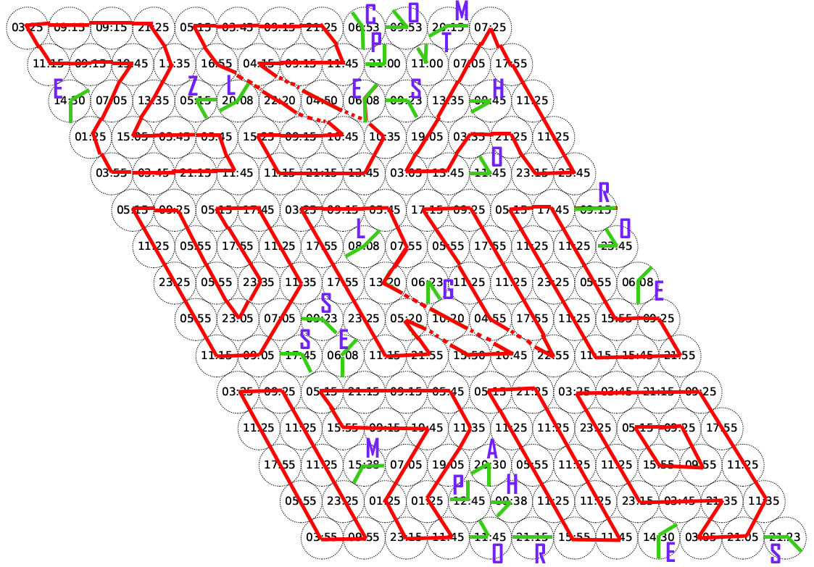
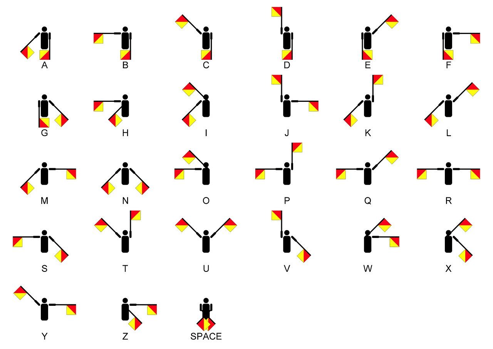

# Tâche 18

Nous cherchons une date, et la réponse à la question cachée.

## Analyse

C'est amusant ce mixage d'horloges digitales dans leur carcan analogique. Remettons donc en place de bonnes vieilles aiguilles.

## Solution 

La date est évidente, il s'agit du **25 avril 1719** (date de publication de Robinson Crusoe par Daniel Defoe - peut être aucun rapport)

J'ai colorié en rouge les horloges qui semblent bien réglées et participer au dessin général, et en vert celles qui semblent hors sujet.

Les horloges qui sont toutes seules font clairement références aux **sémaphores**

En remplaçant ces horloges par leur lettre correspondante, on trouve la question suivante:

*COMPTEZ LES HORLOGES SEMAPHORES*

**La réponse est donc 28**
