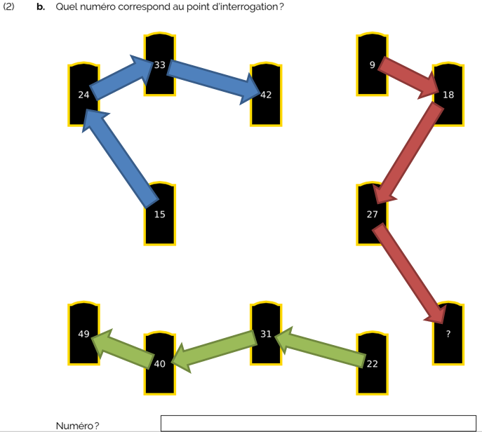

la réponse est 36:
on peut relier les portes/pierres tombales par paquet de quatre pour générer ainsi 3 suites de raison 9.
* 15-24-33-42
* 22-31-40-49
* 9-18-27-**36**

J'aurais trouvé plus élégante la réponse 26 vu que cela serait resté dans le thème des réponses 22c et 22d...
Si quelqu'un trouve mieux, qu'il fasse signe ;)
