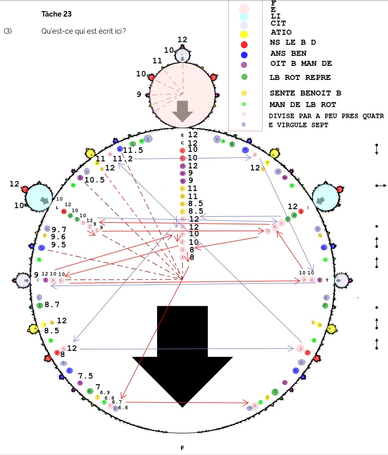

## Tâche 23

Qu'est-ce qui est écrit ici ?

## Analyse

Les lettres en gras nous mettent sur la piste: on peut les ordonner en suivant un schéma, et l'on trouve *FELICITATION*. Je n'ai pas encore cerné la séquence à suivre, mais je suivrais ces 2 règles de base:
* on sélectionne la lettre qui est sous le plus grand cercle;
* à taille de cercle égale, il faut privilégier la gauche de la droite et le bas du haut;
* une fois une lettre utilisée, la taille du cercle diminue et la lettre disparait.

**FELICITATIONS....**


## Solution (1er essai)

Etant donné la règle proposée par Baudouin, voici une image donnant les tailles (relatives) de chaque flèche, que j'ai redisposées directement à côté de chaque lettre. Les plus petites flèches sont assez difficiles à mesurer, car il faut faire des captures d'écran au zoom maximum pour les voir, il y a peut-être une petite imprécision.


Ce n'est pas si évident, je me demande si il ne faut pas plutôt considérer que les lettres sous les flèches de même taille sont à grouper ensemble et qu'il faut essayer de former des mots qui peuvent être composés avec la fin et le début des groupes précédent et suivant.

Voici où j'en suis: 
```
F E LI CI ATIO NSLEBD ANSBEN OANITBMDE LBOTRREPRE EBOISEENNTTB MAND*EL*BROT VIPEUAPADESQRIAUPRSETR EVIRGULESEPT
```

Ce qui donne: **FELICITATIONS LE "B" DANS BEN... ...QUATRE VIRGULE SEPT???**

et dans la version néerlandaise : **PROFICIAT DE B IN BEN... ... VIER COMMA ZEVEN???**

On est sur la bonne voie mais ça se complique...

## Solution (2e essai à 99% concluant):

Pour ordonner les lettres j'ai assigné à chaque cercle une valeur horaire par rapport a son cercle de base (cercle sur lequel repose le cercle à analyser), il faut néanmoins assigner les valeurs horaires par symétrie. On peut dès lors grouper les lettres par tailles de cercle et les sous-grouper par valeur horaire. 

Il faudrait ensuite une troisième clé pour déterminer l'ordre dans un sous-groupe.
Faute de trouver la logique, j'ai décidé de vérifier mon hypothèse avec la version néerlandaise.

* En francais: **FELICITATIONS LE B DANS BENOIT B MANDELBROT REPRESENTE BENOIT B MANDELBROT DIVISé PAR A PEU PRES QUATRE VIRGULE SEPT**
* En néerlandais: **PROFICIAT DE B IN BENOIT B MANDELBROT STAAT VOOR BENOIT B MANDELBROT MET EN FACTOR VAN VIER KOMMA ZEVEN**



Après un p'tit check sur Google, j'ai fait la connaissance de *Benoit MANDELBROT* qui a découvert les fractales. Très intéressant, mais il se fait tard pour parcourir ses travaux... 


**PS**: Quelqu'un peut-il prendre la relève pour m'expliquer le message. J'imagine qu'il faut prendre un de ses ensembles fractals les plus connus et multiplier par 4,7 et sans doute localiser le B de Benoit sur la roue fractale pour boucler la boucle... ?
