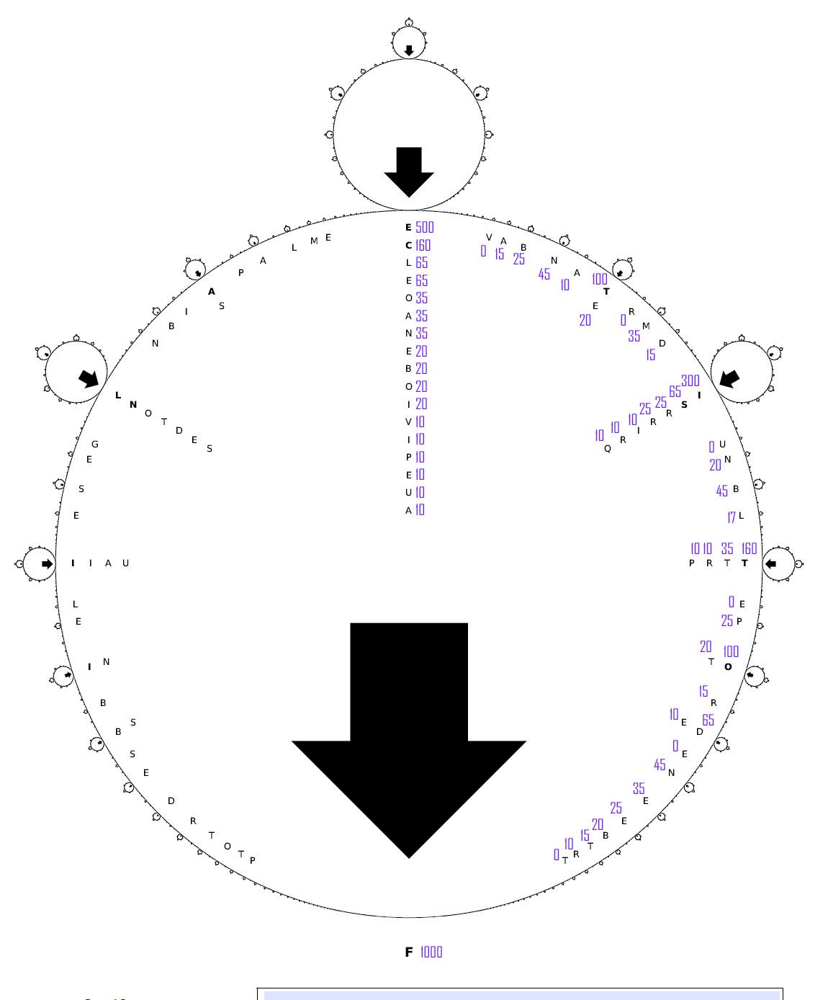

## Tâche 23

Qu'est-ce qui est écrit ici ?

## Analyse

Les lettres en gras nous mettent sur la piste: on peut les ordonner en suivant un schema, et l'on trouve FELICITATION. Je n'ai pas encore cerné la séquence à suivre mais je suivrais ces 2 règles de base:
* On sélectionne la lettre qui est sous le plus grand cercle;
* à taille de cercle égale, il faut privilégier la gauche de la droite et le bas du haut;
* une fois une lettre utilisée, la taille du cercle diminue et la lettre disparait.

**FELICITATIONS....**

## Solution

Etant donné la règle proposée par Baudouin, voici une image donnant les tailles (relatives) de chaque flèche, que j'ai redisposées directement à coté de chaque lettre. Les plus petites flèches sont assez difficile à mesurer, car il faut faire des captures d'écran au zoom maximum pour les voir, il y a peut être une petite imprécision.

