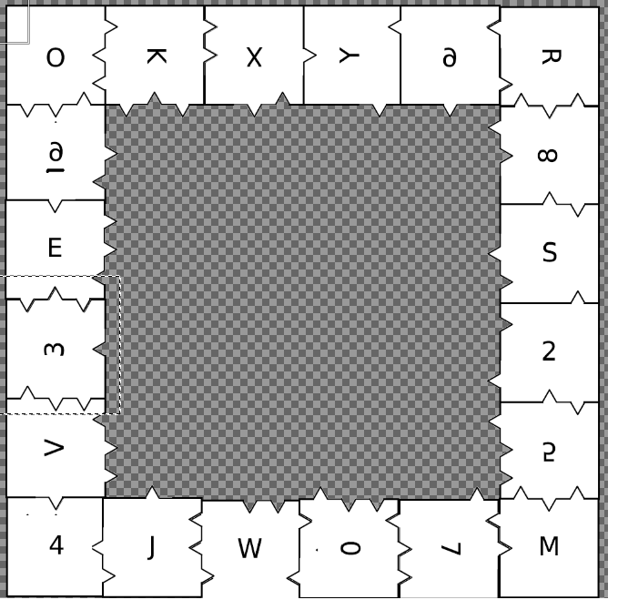

# Tâche 24

Trouvez le carré clé, trouvez ensuite la ville clé correspondante.

## Analyse

Je suis bloqué malgré le fait que je suis à peu près sur d'avoir le fil général.

La question ressemble à un [chiffre de Playfair](https://fr.wikipedia.org/wiki/Chiffre_de_Playfair), pour lequel il est nécessaire de disposer d'un carré de codage/décodage. Ce dernier se construit dans un carré de 5x5 (25 lettres on oublie le plus souvent le **J**), dans lequel on écrit d'abord les lettres de la clé, puis enfin le reste de l'alphabet.

Ici le carré fait 6x6, donc soit on joue également avec les chiffres, soit le carré a refaire ne fait que 5x5.

Pour refaire le carré, a priori il suffit de reconstruire le puzzle en respectant les encoches, mais ce n'est pas si simple !

On est d'abord très tenté de mettre les coins (4, O, M et R) à leur position correspondante. **Je doute cependant que la solution soit si conventionnelle**. Je pense plutôt que si un coté est plat, il suffit qu'il touche un autre coté plat, et pas forcément qu'il soit au bord. De plus il faut faire attention à certaines lettres ou chiffres que l'on peut retourner:

* H, I, N, O, S, Z, 0, 6, 8 et 9 peuvent éventuellement être tournés de 180°
* X et éventuellement O peuvent être tournés de 90°

[Ce programme](./../code/P24.py) essaie toutes les combinaisons possibles, **en vain**. Ce qui est frustrant, c'est qu'il ne trouve même pas de solution pour un carré 5x5, quand bien même on autorise les chiffres. Je ne sais pas si mon code est défecteux ou s'il y a autre chose que je n'ai pas compris.

**'commentaire/Baudouin:**
* bien lire l'énoncé: "Attention ! Pour ce cryptage, les outils sur Internet ne donnent pas toujours la bonne réponse, nous vous
conseillons donc de vérifier avec plusieurs outils ou de le faire manuellement."
intrigant... serait-ce par ce que le "j" est à conserver ???
* ce qui m'intrigue encore plus c est la question à déchiffrer, j ai du mal a m imaginer qu'1 carré de Playfair pourrait aider a déchiffrer une si longue question qui ne comporte que des A D F G V X, en plus dans le codage de Playfair on ne peut pas avoir 1 paire de lettre avec 2 meme lettres....
* Tout cela étant dit, cela me fait penser au carré de Polybe en base36. il faudrait dès lors composer un carré de 8x8 afin de trouver la clé de décodage pour la question. En faisant de la sorte peut-etre y aura-t-il une ville qui apparaitra... 
* il serait logique que les lettres A D F G V X soient utilisées pour composer le carré de 8x8.

**'Commentaire Gonz'**
* je conseille l'utilisation d'une paire de ciseaux ;-) c'est pas mal comme outil, quoi que hors de portée d'un électricien
* Je pense qu'il faut bien faire un carré, avec des bords droits. Il  y a 4 coins, 16 pièces de bords, et 16 pièces centrales. Mais rien n'exclu la possibilité de réaliser un carré plus petit (5X5)
* Avec des ciseaux et du papier, rien ne t'empêche de retourner une pièce (la lettre n'est juste pas visible, sans doute non utilisée)
* je ne vois pas le problème de tourner n'importe quelle lettre a 90° oiu 180°, du moment qu'elle est lisible.
==> je me focaliserais en 1er lieu sur la réalisation du puzzle (dès que j'aurais une imprimante) la je travaille avec paint, sans souris, c'est un peu lent

**'Commentaire Jef2000'**

* J'ai créé le puzzle au format Gimp: puzzle24-2.xcf . Chaque pièce est un calque séparé. Il y a une fonction pour tourner un calque et pour faire un mirroir
* Si on autorise de retourner les pièces (miroir), il y a plusieures solution pour le cadre 6*6. J'ai ajouté un code python qui trouve toutes les possibilités:
*    O 3 8 S 9 R E X K V 4 J W 0 7 M 5 2 Y 6
*    O 3 8 S 9 R E X K J 4 V W 0 7 M 5 2 Y 6
*    O 3 8 S 9 R E V K X 4 J W 0 7 M 5 2 Y 6
*    O 3 8 J W R E X K V 4 S 9 0 7 M 5 2 Y 6
*    O 3 8 J W R E V K X 4 S 9 0 7 M 5 2 Y 6
*    O 3 E V W R 8 J K X 4 S 9 0 7 M 5 2 Y 6
*    O K X Y 9 R 8 S 2 5 M 7 0 W V 4 J 3 E 6
*    O K X Y 9 R 8 S 2 5 M 7 0 W J 4 V 3 E 6

Les 2 dernières correspondent plus ou moins a ma première solution de cadre, mais quand on essaie  de compléter l'intérieur  on tombe sur des impossibilités.

Dans le reste des solutions, on trouve une séquence commune 0 7 M 5 2 Y 6 O 3. Si je la construit puis essaie de trouver des pièces qui correspondent en commençant par les coins (qui imposent  2 arêtes) on peut  avancer  de proche en proche avec toujours une ou deux solutions possibles, et quand on en a deux, la pièce suivante vient en éliminer une des deux. Une fois rempli tout ce qui est possible, on peut continuer le bord en regardant les pièces intérieurs qui correspondraient et reconstruire le carré de proche  en proche sans avoir a considérer trop de branches en parallèle.

Au final, on obtient:

**'Commentaire Baudouin'**
Bien joué Jeff. Pour ma noble contribution, on voit **RADIUM** apparaître en diagonale. 

@JS: tu pourrais confirmer les contrainte pour la ville clé pour être compatible avec le chiffrement adfgvx ? 
Je suppute qu il ne doit pas y avoir 2x la même lettre et qu un rapport avec Radium serait judicieux. Avec ces hypothèses je suggérerais la ville d'Olen. 

Je n ai pas trouvé de ville anagramme de Radium. 

**'Commentaire JS'**
J'ai implémenté un peu de code Python pour réaliser un codage/décodage ADFGVX et faire des recherches. Pour tester mon implémentation, je me suis assuré que mon programme donnait le même résulat que [ceci](https://www.apprendre-en-ligne.net/crypto/subst/adfgvx.html) et [ceci](https://www.dcode.fr/chiffre-adfgvx).

J'utilise le carré clé suivant: **rwj83oeagqh6xfdlcykzti12vpnbu54s907m**

Ensuite pour la ville, j'en ai essayé quelques unes, comme Paris, là ou Marie Curie a fait ses recherches. Mais ça n'a rien donné. Olen ne fonctionne pas non plus. Ce que j'ai aussi essayé, c'est d'oublier la ville, et de me baser sur le fait que le mot clé (la ville) sert seulement à générer une permutation de colonnes. Du coup j'ai écrit un programme qui teste toutes les permutations possibles pour voir ce qu'il en ressort. J'ai fait le test pour toutes les permutations jusqu à une longueur de 9 et je n'ai rien trouvé d'intéressant. Soit la ville clé contient plus de lettres, soit ce qu'il faut trouver n'est pas en français (mais ça serait étonnant quand même).

Autre point embêtant: Le message codé doit normalement être un multiple de la longueur de la clé. Ici le message fait 86 (43x2) caractères. Du coup c'est très bizarre car la ville ne fait certainement pas 2 lettres, ni 43 lettres. Je ne comprends pas, si quelqu'un veut bien relire la spec du codage ADFGVX pour confirmer ça serait bien.

Sinon, normalement, chaque lettre de la ville ne devrait être présente qu'une fois. Cette règle sert juste à ne pas avoir d'ambiguité quand on génère une permutation de colonne sur base de la clé, car il y aurait plusieurs possiblités en cas de lettres identiques.

Donc pour le moment, c'est un peu bloqué de mon coté.

Update: J'ai trouvé cette [vidéo](https://www.youtube.com/watch?v=Y5-ory-Z25g), où le principe est un poil différent quand la taille du message n'est pas un multiple de la taille de la clé. Aucun caractère factice n'est utilisé et du coup c'est peut être comme ça que c'est fait ici. J'investigue.

Update2: Haaaaarg, je viens de me rendre compte qu'il y a 8 carrés clé possible, ça dépend comment on le regarde !!
