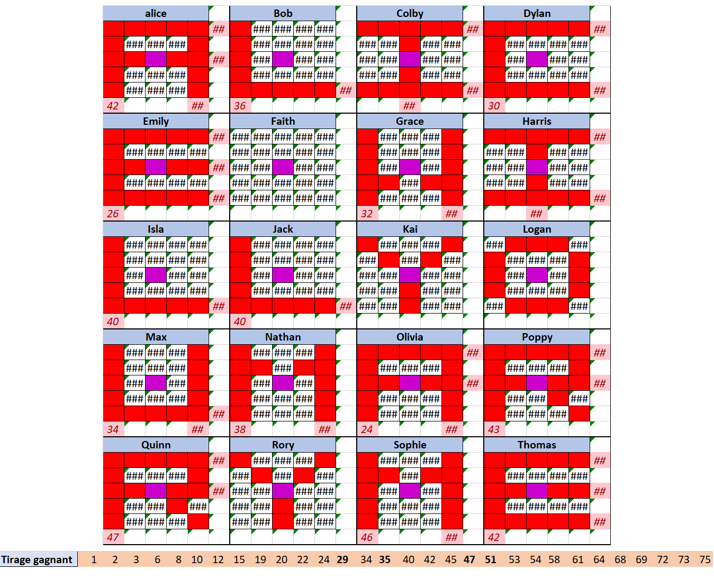

# Tâche 25

Alice et Bob vont ensemble à une soirée bingo Écossaise, ils se joignent à une grande table
avec de nombreux participants. Après quelques tirages, la manière selon laquelle les nombres
sont choisis ne semble plus tout à fait due au hasard . Après exactement 30 tirages, Alice et
Bob reçoivent soudain de grands applaudissements, pourquoi ? Et à qui appartient la carte
encore vide après 30 tirages ? 

## Analyse
**Hypothèses:**
* La partie de Bingo s'arrête quand le 1er joueur fait BINGO.
* Pour faire BINGO, il faut soit remplir une ligne horizontale, soit 1 ligne verticale ou soit 1 ligne diagonale.
* La case FREE SPACE peut être utilisée comme joker. Elle est considérée préremplie.
* il y a 75 boules dans cette partie de BINGO.

**Observations:**
* les nombres 16, 31 et 46 ne sont sur aucun des cartons. Ils peuvent donc être tirés lors des 30 premiers tirages sans avoir aucune influence sur la partie.

*- Raison des applaudissements:*
**Alice et Bob sont les premiers a faire BINGO simultanément lors 30eme tirage !**

*- A qui appartient la carte encore vide après 30 tirages:*
Le carton de **Harry** est toujours vide après 30 tirages

NB: Le tirage qui permet de faire cette situation est: 
* 29 premiers numeros: 2	3	10	12	16	17	18	21	24	25	30	31	33	37	39	40	41	43	46	47	48	50	53	63	64	65	66	68	72
* 30ème numéro: **15**

@JS: j'avais trouvé que Dylan pouvait avoir son carton vide après 30 tirages, mais dans cette configuration il y avait d'autres gagnants que Alice & Bob avant le 30e tirage. Pourrais-tu trouver tous les cartons qui pourraient techniquement rester vides après 30 tirages ? Cela permettrait de vérifier qu'il y ait bien qu'une seule solution avec mes hypothèses de départ. 

**Gonz:/**
## SOLUTION

Il fallait avoir la foi, le foie, et un peu de jugeote :-)

Les grilles de 5x5 se prêtent bien au dessin. On trouve rapidement la confirmation en se renseignant un peu sur [ce type de Bingo](http://www.90ballbingos.com/75-ball-bingo-patterns.html):

La création [d'un fichier Excel](25-Bingo-A.xlsx) qui colore directement chaque carton m'a permis de rapidement identifier des motifs similaires.

L'intitulé de l'énoncé laisse également sous-entendre que ces gens ne jouent pas réellement au Bingo. La possibilité d'une demande en mariage m'est apparue assez rapidement (parmi beaucoup d'autres idées) mais je n'ai pas directement creusé plus en profondeur (j'étais parti sur WILLYOUMARRYMEALICE qui faisait exactement 19 lettres + un blanc, le compte était bon).

J'aurais gagné du temps si j'avais poussé l'idée de départ un peu plus et écouté Baudouin: "trouver le **E**", surtout que dans les deux cas:

WILLYOUMARRYMEALICE
ALICEWILLYOUMARRYME

La dernière lettre était un E.

Autre subtilité, rien n'indiquait que les lettres étaient en 5x5, j'avais identifié deux motifs de **A** identiques en *5x4*, j'avoue que ça m'a perturbé un moment. J'ai perdu du temps en essayant de fabriquer des lettres de *5x4* (surtout que je restais sur l'idée que *Harris* devait rester vide)

Une fois envisagées les lettres en *5x5*, le premier **A** génère directement une série de caractères qui ressemble vraiment trop à une ébauche de message, avec oh magie, *Faith* qui reste miraculeusement vide. A partir de là, il m'a fallu 10 min pour remplir les autres lettres (notamment le dernier **E**) tout en m'assurant que *Faith* restait bien vide.
 

 

