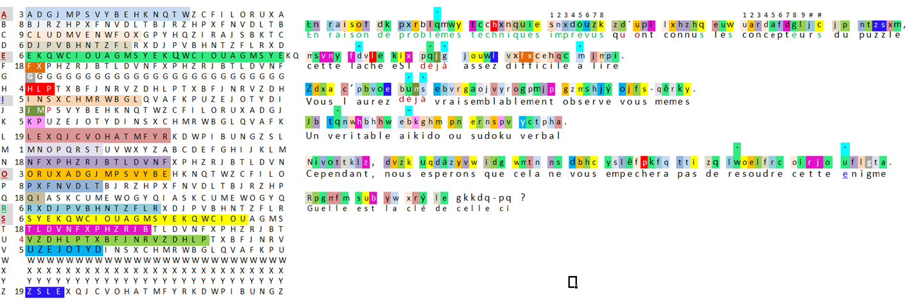

# Tâche 27

En raisof dk pxrblqmwy tcchxnquie ...

## Analyse

Le début de la phrase est parfaitement compréhensible, mais semble se brouiller de plus en plus quand on avance dans la lecture. En y regardant d'un peu plus près, il apparait que la première occurrence de chaque lettre n'est pas altérée, mais qu'ensuite elle subit un décalage de raison qui semble constante. Par exemple, le **n** de *raison* devient un **f** avec un décalage de 18, et le **e** de *de* devient un **k** avec un décalage de 6.

La lettre **e** est la plus intéressante à étudier, car elle est fréquente et elle permet de se rendre compte de la *raison constante*. En supposant que le début de la phrase est **En raison de problèmes techniques ...**, on constate que le **e** devient successivement **k(+6)**, **q(+12)**, **w(+18)**, **c(+24)** et **i(+30)**.

Chaque lettre semble avoir une raison différente et la valeur précise de celle-ci n'est pas élucidée à ce stade. Néanmoins, si cette raison est constante pour chaque lettre, alors il suffit de rencontrer chaque lettre deux fois pour disposer de toute l'information nécessaire.

Merci à Baudouin qui a trouvé le prochain mot: **imprévus**. Ce qui permet à ce stade de savoir:

| a | ? | | | h | ? | | o | 3 | | v | ? |
| --- | --- | --- | --- | --- | --- | --- | --- | --- | --- | --- | --- |
| b | ? | | | i | 5 | | p | 8 | | w | ? |
| c | ? | | | j | ? | | q | ? | | x | ? |
| d | ? | | | k | ? | | r | 6 | | y | ? |
| e | 6 | | | l | ? | | s | 6 | | z | ? |
| f | ? | | | m | 1 | | t | ? | |   |   |
| g | ? | | | n | 18| | u | 5 | |   |   |

Baudouin/
### observations: 
1. les accents ont l'air d'être au bon endroit, mais pas nécessairement être le bon accent.
2. il semble judicieux de s'attaquer au mot 10 (vardafdgljc) et au mot 24 (eburgaojuyrogpmjp)

#### mot 10 (vardafdgljc):
par déduction on peut émettre les hypothèses suivantes:
* ce mot ne commence pas par v-e-s-f-g-i-j-k-m-n-o-p-r-s-u-w-y
* ce mot ne contient pas j-k-m-o-y
* si présent, "r" et "u" ne peut etre qu' en position 10
* si présent, "p" ne peut etre qu' en position 6
* si présent, "g" ne peut etre qu' en position 8
* si présent, "e" ne peut etre qu' en position 2,5 ou 8
* si présent, "i" et "s" ne peut etre qu' en position 11
* il y a peu de chance que "a" soit en position 2 ou 5
* il y a peu de chance que "d" soit en position 4 ou 7
* si présent, "n" ne peut etre qu' en position 3	
* ce mot ne se termine pas par e-m-n-o-p-r-u
malgré cela je ne trouve pas de mots... j'ai du faire une erreur...
    
#### mot 24 (eburgaojuyrogpmjp):

une terminaison en "EMENT" semble être une possibilité intéressante mais pas la seule malheureusement. Les mots qui fonctionnent en considérant une terminaison en "EMENT" seraient les suivants:

* A	G	R	I	C	U	L	T	U	R	A	L	E	M	E	N	T
* **C	O	L	L	A	B	O	R	A	T	I	V	E	M	E	N	T**
* G	R	A	P	H	O	L	O	G	I	Q	U	E	M	E	N	T
* Q	U	I	N	Z	O	M	A	D	A	I	R	E	M	E	N	T
* S	O	M	N	A	M	B	U	L	I	Q	U	E	M	E	N	T
* **S	Y	M	P	T	O	M	A	T	I	Q	U	E	M	E	N	T**
* **V	R	A	I	S	E	M	B	L	A	B	L	E	M	E	N	T**
      
mes 3 préférés sont en gras

## Solution

### Eureka pour l'étape 1

le texte vient d'être décrypté grâce a l'aide providentielle de ma chère et tendre...
vous l'aurez deviné, il y avait une subtilité qui empêchait la force brute de déchiffrer ce code. Il fallait inverser les **"U"** et les **"V"** dans le texte comme l'indiquait subtilement l'erratum. La suite de lettre pour U et V doit aussi être modifiée: 
* la série d **U** à un pas de 4 en commençant a la lettre **V**; 
* la série de **V** à un pas de 5 en commençant a la lettre **U**;
Subtilité quand tu nous tiens...

Voici le texte final ainsi que la tableau de conversion.

**En raison de problèmes techniques imprévus qu'ont connus les concepteurs du puzzle, cette tâche est déjà assez difficile à lire. Vous l'aurez déjà vraisemblablement observé vous-mêmes.
Un véritable aïkido ou Sudoku verbal. Cependant, nous espérons que cela ne vous empêchera pas de résoudre cette énigme. Quelle est la clé de celle-ci ?**

Voici les détails du décryptage:

Et bien évidemment, ça serait trop facile si l'énigme s'arrêtait là...

La question est de la tâche 27 est **QUOI?**
Il est remarquable que dans l'énigme, il y ait une erreur supplémentaire: 
La dernière question se décrypte par "**G**uelle est la clé de l'énigme?" car la seule lettre à ce stade qui peut remplacer "R" est le "G" pour laquelle aucune raison n'a été trouvée (la lettre G étant apparue qu'une seule fois)
Pour écrire correctement "**Q**uelle", il faut remplacer le "**R**pgmfm" par "**A**pgmfm".

Sinon en appliquant le décryptage à "**QUOI?**" nous obtenons "STHV" en considérnt que le "R" de "**R**pgmfm" soit remplacé par "**A**pgmfm" mais je ne trouve pas de sens à STHV (en excluant la **S**ociété de **T**ransport du **H**aut-**V**ar))
Nous obtenons "**ATHV**" en ne remplaçant pas le "R" par "A". ce qui est:
* soit un modèle du fabriquant d'aspirateur DYSON: le célèbre **ATHV 30RN**
* soit le code du virus de l'herpes: AtHV - **At**eline **he**rpesvirus

Je ne pense pas que ce soit la réponse mais elle mériterait bien 1 point bonus ;)

Si quelqu'un est motivé à faire la 27 en néerlandais, ça pourrait nous mettre sur la piste...

JS/
### Trouver la clé

Merci Baudouin et Elodie pour ce remarquable travail, et surout d'avoir trouvé cette clé subtile relative au célèbre fabriquant d'aspirateur. Ce étant dit, le tableau comporte une erreur, la séquence pour le Q est "Q-Z-I-R", ce qui fait qu'il n'y a pas d'erreur (supplémentaire) dans le puzzle.

Je vais donc quand même m'aventurer à proposer une autre clé, certes plus conventionnelle: la clé, c'est simplement le décalage à appliquer à chaque lettre. En interprétant le tableau (A=3, B=8, C=9, etc.), et en transposant les chiffres en lettres, nous obtenons:

**CHIFFR?DECESARCHRFFRDE???S**

Le début est prometteur, la fin un peu moins. Une dernière subtilité, sans doute.
