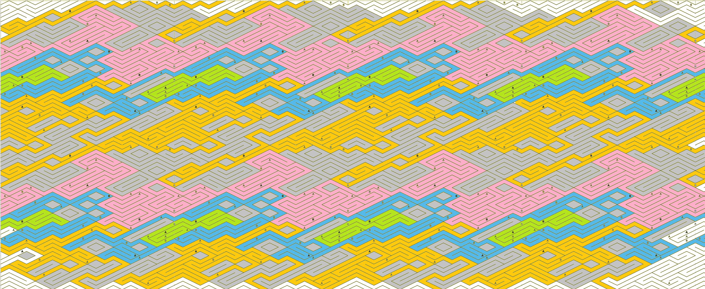
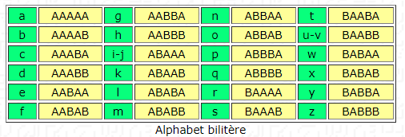
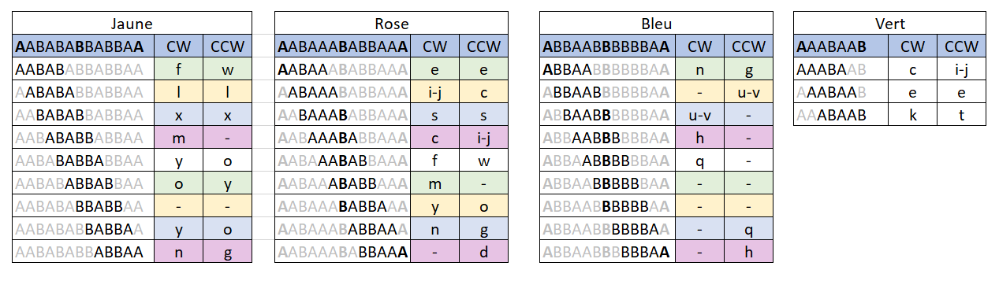

# Tâche 30

Pour ceux qui veulent résoudre ce triptyque dans les règles de l'art, ...

## Analyse

**Idée**:
On remarque que la zone entourée défini une zone qui se réplique (gauche/droite, haut/bas) 

En agençant les images comme un tryptique (gauche-milieux-droite par défaut, mais j'aurais pu essayer haut-milieux-bas)
et en coloriant certaines zones, on tombe sur des boucles fermées. Chaque boucle ne comporte qu'un seul A en gras, et un seul B en gras

En prenant arbitrairement le A comme la première lettre, j'obtient les séquences suivantes:

Zone en Rouge:  AAABAA(B) 
Orange: AABBBB(B) sens anti-horlogique et ABBAAB(B) 

Qui, a peut de chose près, semble être un code couleur hexadecimal 

Pour les conversions de couleurs, c'est ici:

https://www.w3schools.com/colors/colors_hexadecimal.asp

Vu que ça parle de peinture, de triptyque, il me semble qu'il y a quelque chose a creuser avec la couleur.

JS/ Je rejoute une idée car ces séquences de A et B me font directement penser à [ce code](https://www.apprendre-en-ligne.net/crypto/stegano/bilitere.html). Les lettres en gras donnent peut-être le point de départ.

MISE A JOUR DE L IMAGE ET DES SEQUENCES

en gras entre parenthèse, sens horlogique

VERT: (A)AABAA(B) => **E** (Palindrome)

BLEU: (A)BBAAB(B)BBBBA(A) => **U/V** et **Q** Tout 2 ne peuvent se lire qu'en CCW

ROSE: (A)ABAAA(B)ABBAA(A) => **I/J** et **N** en lecture CW; **C** et **G** en lecture CCW

JAUNE: (A)ABABA(B)BABBA(A) => **L** (Palindrome); **O** en lecture CCW ou **Y** en CW
 
 Ce qui donne **LOGIQUE** en respectant une logique de type tryptique. En effet *LOG* sont selectionées en CCW, *I* en CW et *QUE* en CCW

Gonz/ 

