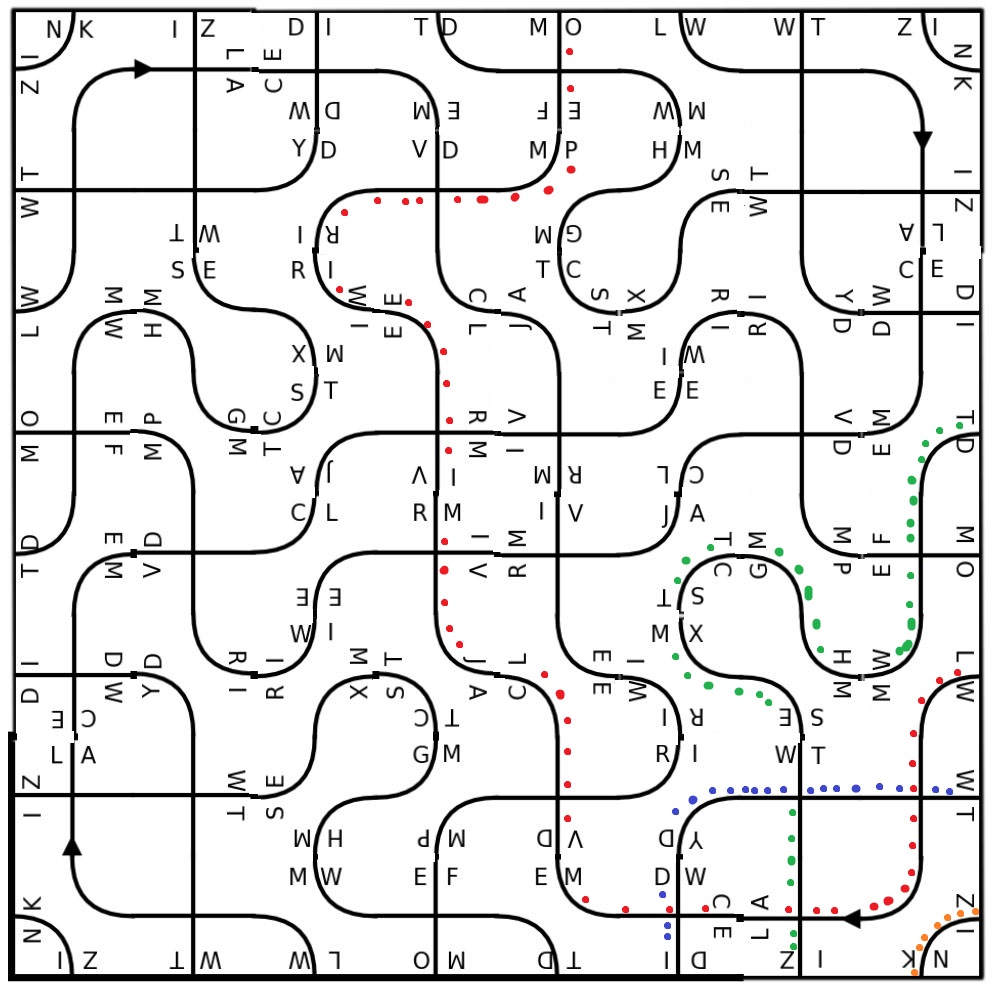
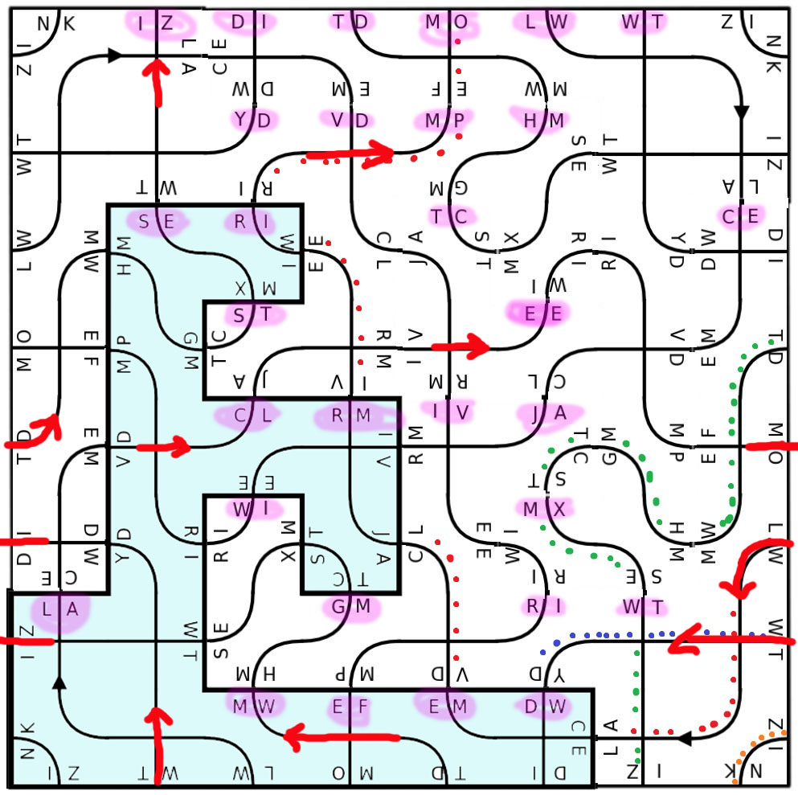

# Tâche 32

Une seule pièce est suffisante pour l’ensemble de ce puzzle. Qu’est-ce qui est écrit ici ?

## Analyse

Une seule pièce suffit, certes, mais il s'agit d'un puzzle, il faut donc plusieurs pièces. Que cela ne tienne, utilisons donc la même plusieurs fois, puisqu'elle a vraiment l'air de pouvoir s'agencer avec elle-même. Cela donne le carré suivant, sur lequel apparaissent 4 chemins distincts, coloriés avec des points.

La flèche semble indiquer la direction à parcourir pour l'un d'entre eux. Tout le long on rencontre des lettres par paquets de deux, et chaque paquet se retrouve tête-bêche avec un autre paquet.

Il est fort probable que le message soit codé. Comme les lettres apparaissent par deux, cela laisse penser au codage [Play-Fair](https://www.dcode.fr/chiffre-playfair), ou encore a [Four-Square](https://www.dcode.fr/four-squares-cipher). Le problème c'est que Play-Faire nécessite une clé, et Four-Square en nécessite même deux.

Le mot **ZINK** pourrait éventuellement être la clé, mais aucune idée pour une éventuelle deuxième clé.

En collectant les lettres sur le chemin rouge, on obtient

* LA-EM-CL-RM-EE-RI-MP-MO et 
* LW-CE-VD-JA-IV-WI-RI-EF

ou bien encore
..LW-LACE-EMVD-CLJA-RMIV-EEWI-RIRI-MPEF-MO..

selon la manière d'interprétation

Pour le moment, je n'arrive à rien en essayant de décoder ces séquences

Baudouin/

 Elo et moi avons déchiffré le début: il faut lire les paires de lettres en suivant la flèche et en commençant par "LA". Attention il ne faut lire que les lettres qui sont rencontrées horizontalement a l'endroit, voir schéma ci-contre.
 
 
 
 Cela nous donne:
 
 LA CL EE ST SE IZ EM RM RI MP MO MW GM DW LW CE JA WI MX WT WT VD IV RI EF TD HM TC YD DI
 
 => **La clé est seize** ..... mais je n'arrive pas à l'appliquer correctement à la suite du code.
 
 JS/
 ## Solution
 
 Grâce à Baudouin et Elodie, nous savons maintenant que la clé est 16 ou seize. Il reste alors la suite
 **MRMRIMPMOMWGMDWLWCEJAWIMXWTWTVDIVRIEFTDHMTCYDDI**
 
 à déchiffrer correctement. J'ai essayé un chiffre de Cesar avec une rotation de 16 et -16 sans résultat. Par contre, déchiffrer cette séquence avec Vigenere donne:
 
 **UNE SEULE PIECE EST SUFFISANTE POUR L'ENSEMBLE DU PUZZLE**
 
