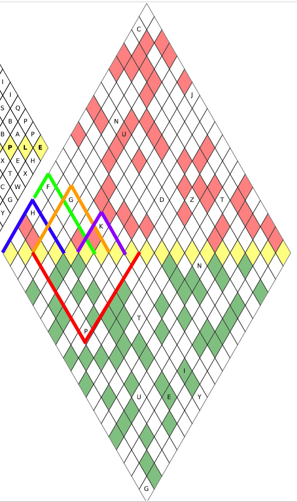

# Tâche 34

Nous donnons un exemple correctement rempli. Quels sont les cinq endroits que nous recherchons
dans ce puzzle?


## Analyse

La figure en diamant donnée en exemple est assez facile à comprendre. Dans sa moitié supérieure, chaque lettre est la somme modulo 26 des deux lettres sou-jacentes (ex: E+X=B mod 26). La règle est un peu différente dans la moitié inférieure, dans le sens où il est nécessaire d'effectuer une soustraction (ex: E-X=H mod 26).

On comprend alors que la première partie de l'énigme consiste à retrouver une phrase/mot à placer sur les cases jaunes, de telle sorte que les quelques lettres disséminées ça et là sur le diamant soient respectées. Il est important de comprendre que chaque case ne peut être influencée que par les lettres sur le sous-diamant dont il est la pointe (voir figure). Par exemple, le **H** sur la gauche résulte strictement des 4 premières cases jaunes (pointe bleu).

Il est également important de remarquer qu'il n'est pas nécessaire de calculer chaque lettre intermédiaire pour connaitre la lettre au sommet d'une pointe, la connaissance de la base permet de la prédire directement. Pour ce faire, on peut déterminer le nombre de fois qu'une lettre de la base intervient dans le résultat final. Par exemple, pour un mot de 7 lettres comme dans **EXEMPLE**, les coefficients sont 

* 1, 6, 15, 20, 15, 6, 1 vers le haut
* 1, -6, 15, -20, 15, -6, 1 vers le bas

si bien que :

* 1.E + 6.X + 15.E + 20.M + 15.P + 6.L + 1.E = J mod 26
* 1.E - 6.X + 15.E - 20.M + 15.P - 6.L + 1.E = F mod 26




Ces principes étant fixés, il reste encore à trouver une phrase de 19 lettres à écrire dans le grand diamant.

Ce programme tente de déterminer laquelle en suivant les étapes suivantes:

1. Détermination de toutes les combinaisons de 4 lettres qui donnent un **H** (pointe bleu)
2. Détermination de toutes les combinaisons de 2 lettres à ajouter à la l'étape 1 qui donnent un **F** (pointe verte)
3. Idem pour la lettre à ajouter à l'étape 2 de telle manière à obtenir un **G** (pointe orange)
4. Idem pour la lettre à ajouter à l'étape 3 de telle manière à obtenir un **K** (pointe violette)
5. Idem pour la lettre à ajouter à l'étape 4 de telle manière à obtenir un **P** (pointe rouge)

Chaque combinaison est filtrée de telle manière à éliminer tout ce qui n'est pas une juxtaposition de mots en français.

La liste des résultats est alors [la suivante](34-Candidates.txt), mais je n'y vois aucune combinaison qui fait du sens.

**Baudouin:/** Je vois bien 118: '**NIGER**-**BITA**-' dans le thème.... Comme ville il y a Bita, Bitam, ou encore Bitama. Je n'ai pas recherché plus loin il y en a peut être d'autres... 

**JS:/** En m'inspirant de ta remarque qu'il s'agisse d'un endroit, j'ai essayé de le résoudre avec une liste de tous les pays du monde, ainsi que toutes les villes de Belgique. Cela fonctionne avec les villes de Belgique mais il y a en fait plus simple pour résoudre ce problème.

## Solution

La méthode *simple* et rapide part de la constation que nous recherchons 19 lettres jaunes (donc 19 degrés de liberté), et qu'il y a très précisémment 19 lettres disséminiées ça et là dans le diamant. Comme chaque lettre est une combinaison linéaire (modulo 26) des 19 lettres jaunes, cela donne un système de 19 équations à 19 inconnues à résoudre modulo 26. Plus précisémment, nous avons:

```
1*f + 2*g + 1*h = 10 # K
1*a + 3*b + 3*c + 1*d = 7 # H
1*c + 4*d + 6*e + 4*f + 1*g = 6 # G
1*i + 4*j + 6*k + 4*l + 1*m = 3 # D
1*k + 4*l + 6*m + 4*n + 1*o = 25 # Z
1*m + 4*n + 6*o + 4*p + 1*q = 19 # T
1*a + 5*b + 10*c + 10*d + 5*e + 1*f = 5 # F
1*d + 9*e + 36*f + 84*g + 126*h + 126*i + 84*j + 36*k + 9*l + 1*m = 20 # U
1*c + 10*d + 45*e + 120*f + 210*g + 252*h + 210*i + 120*j + 45*k + 10*l + 1*m = 13 # N
1*g + 12*h + 66*i + 220*j + 495*k + 792*l + 924*m + 792*n + 495*o + 220*p + 66*q + 12*r + 1*s = 9 # J
1*a + 17*b + 136*c + 680d + 2380*e + 6188*f + 12376*g + 19448*h + 24310*i + 24310*j + 19448*k + 12376*l + 6188*m + 2380*n + 680*o + 136*p + 17*q + 1*r = 2 # C

1*m - 1*n = 13 # N
1*g - 5*h + 10*i - 10*j + 5*k - 1*l = 19 # T
1*c - 6*d + 15*e - 20*f + 15*g - 6*h + 1*i = 15 # P
1*h - 9*i + 36*j - 84*k + 126*l - 126*m + 84*n - 36*o + 9*p - 1*q = 8 # I
1*d - 11*e + 55*f - 165*g + 330*h - 462*i + 462*j - 330*k + 165*l - 55*m + 11*n - 1*o = 20 # U
1*f - 11*g + 55*h - 165*i + 330*j - 462*k + 462*l - 330*m + 165*n - 55*o + 11*p - 1*q = 4 # E
1*h - 11*i + 55*j - 165*k + 330*l - 462*m + 462*n - 330*o + 165*p - 55*q + 11*r - 1*s = 24 # Y
1*a - 18*b + 153*c - 816*d + 3060*e - 8568*f + 18564*g - 31824*h + 43758*i - 48620*j + 43758*k - 31824*l + 18564*m - 8568*n + 3060*o - 816*p + 153*q - 18*r + 1*s = 6 #G
```

Ce système peut être résolu avec des outils en ligne, comme ce [solveur d'équations modulaires](https://www.dcode.fr/solveur-equation-modulaire). Nous trouvons alors:

a=12, b=14, c=13, d=18, e=11, f=0, g=11, h=14, i=20, j=21, k=8, l=4, m=17, n=4, o=13, p=0, q=12, r=20, s=17

ou encore:

**MONS LALOUVIERE NAMUR**

Cela fait 3 endroits, reste à en trouver 2 grâce aux lettres en rouge et vert.

A suivre