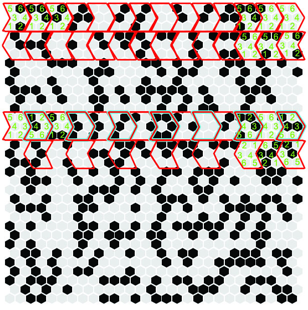
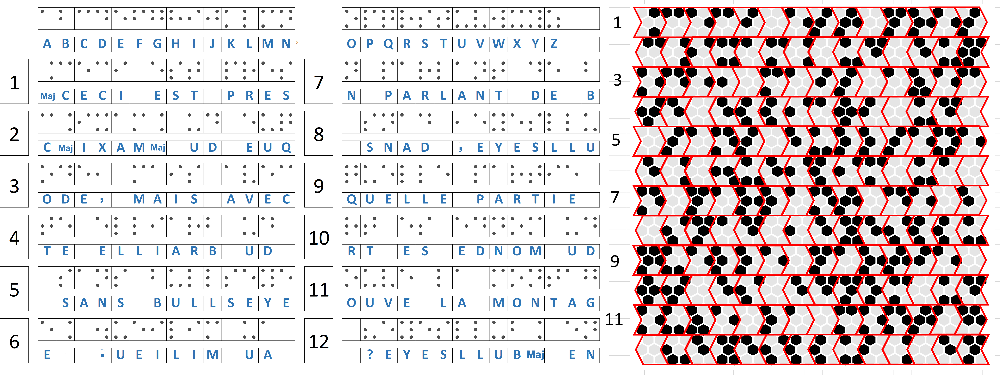

Probleme N°35

Le patern pourrait faire penser à un maxicode (alternative du QR code)

https://www.dynamsoft.com/Barcode-Types/MaxiCode.aspx

La taille semble correcte. Il manque le cercle de centrage
Je n'arrive toutefois pas a le decoder.

https://www.barcodefaq.com/knowledge-base/maxicode-compression/

\Baudouin

L'idée du maxicode est très intéressante. Pourquoi ne pas s'en inspirer pour faire des paquets de 6 bits à la manière du maxicode...
Seulement, il y a plusieurs possibilités pour ordonner ces bits. J ai représenté 2 possibilités dans le schéma ci-contre:

Je ne sais pas comment décoder ces paquets de 6 bits: soit en base64 ou soit en les regroupant en Octet. il y a au total 1008 bits ce qui correspond à 126 octets. qui sait...

J'ai essayé à vue d'oeil de repérer des occurences pour identifier les "E" mais je n y suis pas encore arriver.

## Remarques:
* La version néerlandaise a des bits différents ce qui laisse sous-entendre qu'on recherche un texte en francais.
* La question vaut seulement 2 points donc la logique doit être assez simple.

## SOLUTION

il s'agit de code braille

la réponse est antarctique

https://www.google.com/maps/place/Bullseye+Mountain/@-77.9026183,158.5591231,3z/data=!4m5!3m4!1s0xaf8d0a0e564e8ff9:0xe1dc625a0f0606b5!8m2!3d-83.916667!4d160.0833331!5m1!1e4
