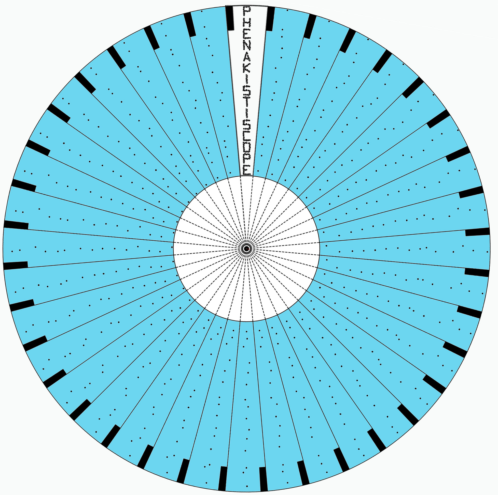

## TACHE 36

Le **phénakistiscope** (mot formé du grec phenax -akos, « trompeur », et skopein, « examiner ») est un jouet optique donnant l'illusion du mouvement attribué à la persistance rétinienne. Il a été inventé par le Belge Joseph Plateau en 1832.

