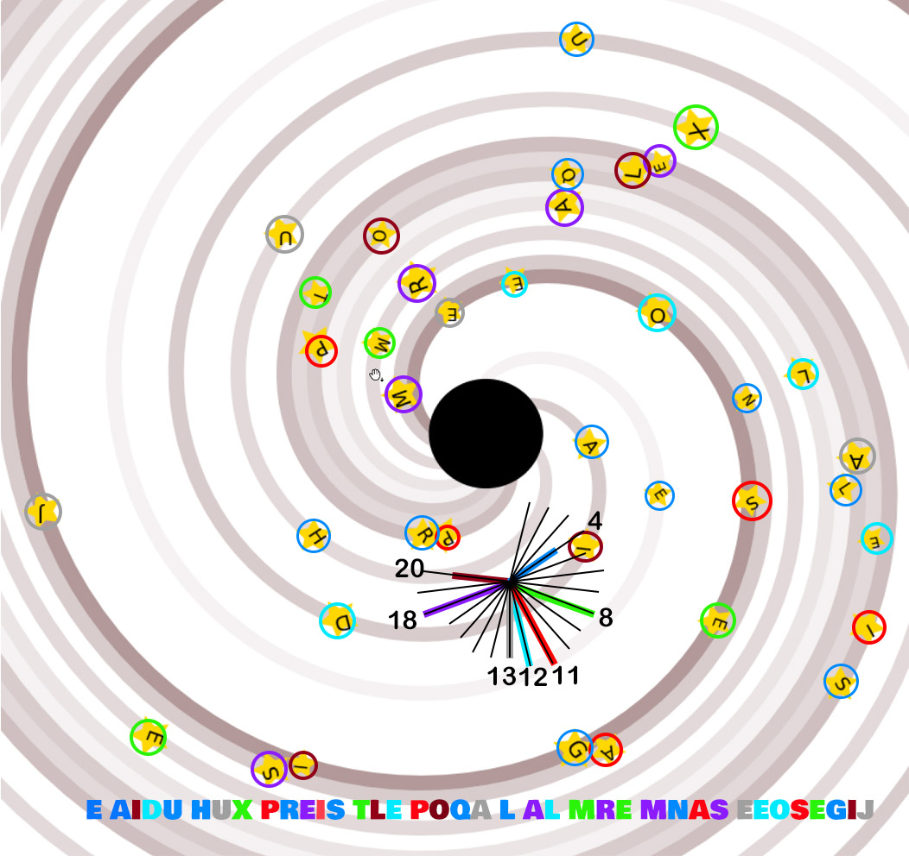

# Tâche 37

Trouvez et répondez à la question suivante

## Analyse

Les lettres semblent pouvoir se remettre dans l'ordre en suivant les bras de la spirale. On trouve alors:

**E AIDU HUX PREIS TLE POQA L AL MRE MNAS EEOSEGIJ**

Par contre, le tout semble codé. Comme les lettres sont dessinées suivant des angles différents, on peut penser à une rotation de lettre, le nombre de pas dépendant de l'angle de la lettre. Voici une image qui met un peu de couleur bienvenue dans tout ça:

Si l'on divise 360° en 26, on obtient des pas de 13,8°. J'ai dessiné ces orientations sur la figure, et on peut alors constater que les lettres sont très précisémment orientées selon certains de ses multiples.

Malheureusement, ça ne donne rien du tout en appliquant ces rotations. Selon que je tourne dans un sens ou dans l'autre, j'obtiens

* AWORQDHPENMXOLRSEUMNHIZEZWUJPARSCHWCOW, ou
* IECPYLHFAVWTWBFQAIUNPSXUJMERLKRQADMKCW

**Baudouin:/** il y a aussi la taille des lettres qui comptent en déplaise à ton épouse...

**JS:/** Certes mais je ne vois pas quoi faire avec.
