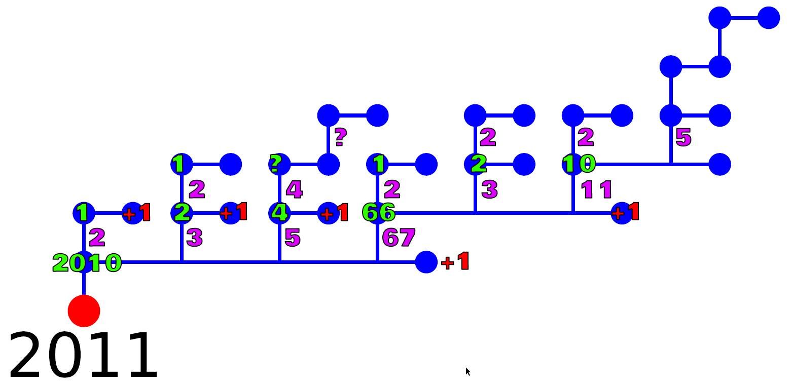
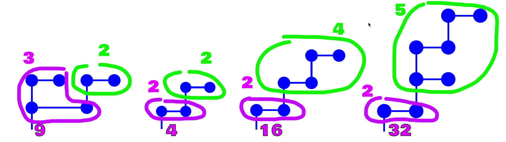

# Tâche 40

Dans le jardin des concepteurs du puzzle, il y a des arbres de formes étranges.

## Analyse

La manière dont sont décomposés les nombres est déroutante, car le nombre de noeuds est toujours conséquent, même lorsque l'on a à faire à des nombres premiers comme 2011 et 2017. Par contre, ces deux derniers sont les seuls qui ne commencent pas avec une branche horizontale sur leur tronc rouge. Même si ce fait est peut être le fruit du hasard, il incite néanmoins à ne pas lâcher la piste de la décomposition en facteurs premiers tout de suite.

La question est alors, comment décomposer un facteur premier de manière unique alors qu'il n'est le produit d'aucun nombre autre que lui-même ? Ce qui m'a personnellement mis sur la voie, c'est la constation que 2017 (un nombre premier donc) est pratiquement identique à 2016, il est juste surélevé et dispose d'une branche horizontale supplémentaire.

Je suis donc parti de l'hypothèse suivante, si un nombre premier, on retranche 1 et on continue avec ce qu'il reste. Sinon, on regarde les termes qui le composent. Faisons donc quelques tests:

* 2012 = 2^2 x 503
* 2013 = 3 x 11 x 61
* 2014 = 2 x 19 x 53
* 2015 = 5 x 13 x 31
* 2016 = 2^5 x 2^2 x 7
* 2018 = 2 x 1009

On peut voir toute de suite que l'idée prend forme, dans le sens où le nombre de branches principales (attachées au tronc rouge) de chacun de ces nombres correspond exactement au nombre de facteurs premiers - pour peu que l'on groupe les facteurs communs en un seul paquet.

L'image ci-dessous applique le principe suivant:

* Chaque noeud se subdivise en autant de branches verticales qu'il n'a de facteurs premiers (les facteurs identiques sont groupés);
* Chaque branche verticale a la valeur de ce nombre premier (ou groupe);
* Les branches verticales sont classées par ordre croissant de valeur;
* Chaque branche verticale (nombre premier) se subdivise en une branche horizontale, équivalente à un +1, et en branches verticales pour décomposer la valeur -1;

Le point qu'il reste à élucider concerne les groupes de valeurs identiques lors de la décomposition, tels que 32=2^5 ou 9=3^2. L'image ci-dessous reprend les différentes puissances présentes dans les exemples. Nous pouvons remarquer que l'écriture d'un tel groupe se réalise en écrivant le chiffre de la base, suivi de l'exposant qui s'enracine dans le noeud le plus en bas à droite.

## Solution

