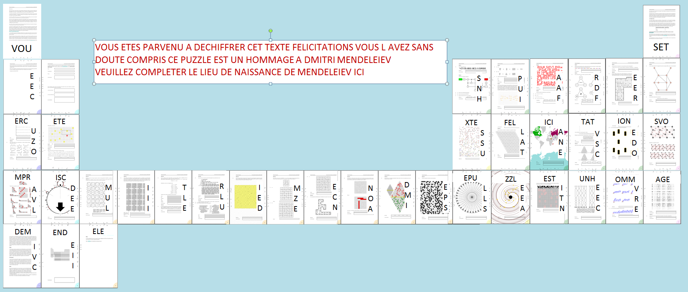

# Tâche 42

**Quelle est la question cachée ???**

## Analyse

On se doute bien que la question est cachée sous forme de flèches sur les bords de la majeure partie des pages. Toute la subtilité étant de pouvoir interpréter ces flèches.

## Solution
L'astuce est d'ordonner les pages selon le tableau de Mendeleïev et la question nous sera dévoilée.
PS: j ai remarqué apres coup que le numero des pages est de la couleur du tablean de Mendeleiev.

La réponse est donc **"Tobolsk"**
