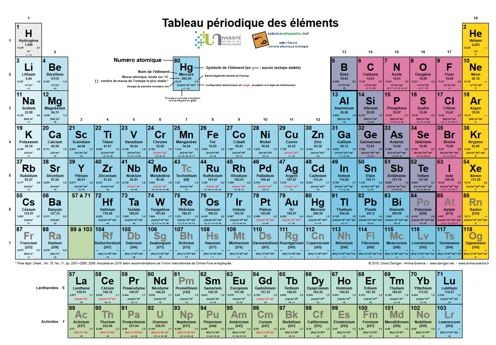
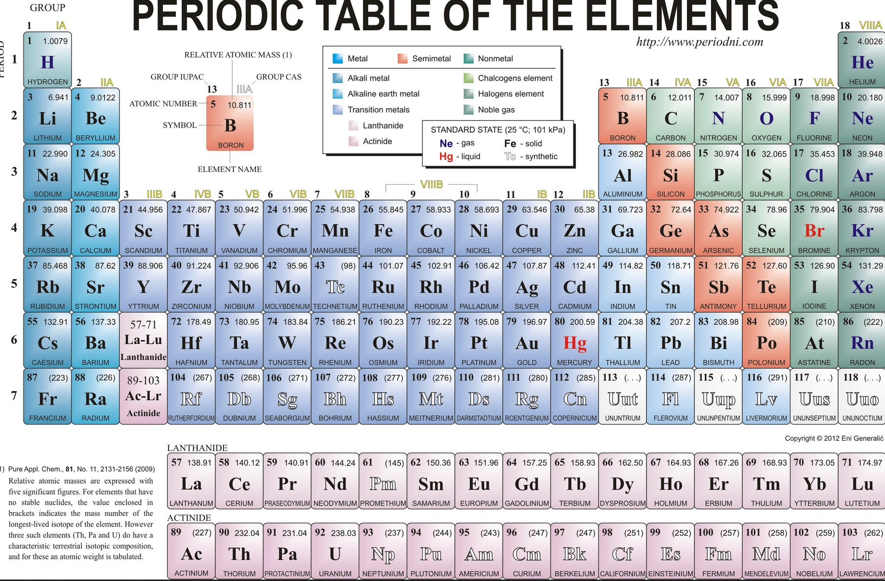

# Tâche 43

Le tableau de Mendeleïv. Voici le nom de tous les éléments en français et anglais:

| Symbole | Français  | Anglais | Cachette  | Explication |
| ------- | --------  | ------- |---------- | ----------- |
| H       | Hydrogène |         |           |             |                     
| He      | Hélium    |         |           |             | 
| Be      | Bérylium  |         |           |             | 
| B       | Bore      |         |           |             | 
| C       | Carbone   |         |           |             | 
| N       | Azote     |Nitrogen |           |             | 
| O       | Oxygène   |         |           |             | 
| F       | Fluor     |         |           |             | 
| Ne      | Neon      |         |31C        | Mot qu'il est possible de former dans la grille            | 
| Na      | Sodium    |         |31C        | TPEJVN, ROT-1 (SODIUM) en x=8,y=7                          | 
| Fe      | Fer       |Iron     |22C (15)   | L'atomium représente le cristal de fer                     | 
| Ag      | Argent    |Silver   |8          | L'un des mots sur le triangle                              | 
| Sn      | Etain     |Tin      |7, 31B     | Dans le mot BARATIN, **TIN** dans la grille flèchée        | 
| Au      | Or        |Gold     |31B        | **OR** Dans la grille fléchée                              | 
| Pb      | Plomb     |Lead     |           |             | 
| Ra      | Radium    |         |24         | en diagonale ds le puzzle recomposé            | 

## Tableau en français

## Tableau en anglais

