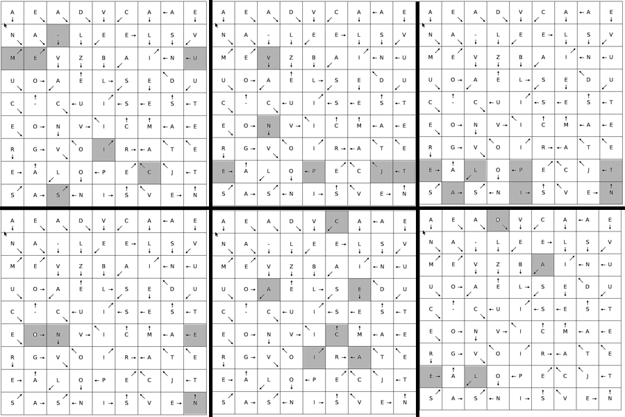

# Tâche 43

erratum du 6 janvier: Au total, **3 des éléments recherchés sont dans une autre langue que le néerlandais/français**
PS: il ne disent pas que c est 3 x en anglais.

Le tableau de Mendeleïv. Voici le nom de tous les éléments en français et anglais:

| Symbole | Français  | Anglais | Cachette  | Explication |
| ------- | --------  | ------- |---------- | ----------- |
| H       | Hydrogène |         |           |             |                     
| He      | Hélium    |         |           |             | 
| Be      | Bérylium  |         |           |             | 
| B       | Bore      |         |           |             | 
| C       | Carbone   |         |31C        | EAICCA, Autoclave (**CARBON**) en x=6,y=3                      | 
| N       | Azote     |Nitrogen |           |             | 
| O       | Oxygène   |         |           |             | 
| F       | Fluor     |         |           |             | 
| Ne      | Neon      |         |31C        | En clair en x=8,y=8            | 
| Na      | Sodium    |         |31C        | TPEJVN, ROT-1 (**SODIUM**) en x=8,y=7                          | 
| Fe      | Fer       |Iron     |22C (15)   | L'atomium représente le cristal de fer                     | 
| Ag      | Argent    |Silver   |8          | L'un des mots sur le triangle. NB: Si Argent fonctionne qlors **TIN** aussi dans PREDESTINIEZ                              | 
| Sn      | Etain     |Tin      |7; 31B; 8; 16| Dans le mot BARA**TIN**; **TIN** dans la grille flèchée; dans PREDES**TIN**IEZ; dans LA**TIN**| 
| Au      | Or        |Gold     |7; 31B     | Dans le mot **OR**BITAL; **OR** Dans la grille fléchée.    | 
| Pb      | Plomb     |Lead     |31C        | Ecrit à l'envers **DAEL** en x=3,y=0                       | 
| Ra      | Radium    |         |24         | En diagonale ds le puzzle recomposé                        |
| Rn      | Le Radon  |         |3          | **Le Radon** est l'anagramme de **Leonard**                |
| Cs      | Césium    |         |31C        | **CE-SIUM** en x=6,y=7            |
| Pt      | Platine   |         |31C        | Son anagramme **PLAINTE** est en x=4,y=7                   |
## Anagrammes plausibles:
* ROBE (Bore)
* RACINES (arsenic)
* MELUSINE (Selenium)
* OMBRE (Brome)
* TRUELLE (Tellure)
* ETALANT (Tantale)
* EPILANT (Platine)
* PLAINTE (Platine)
* PLIANTE (Platine)

## Recherche systématique

[Ce programme](./../code/Tools/mendeliev.py) génère toutes sortes de chiffrements des éléments du tableau périodique, afin de les rechercher systématiquement dans les différents problèmes. La liste de mots générée part de la liste des tous les éléments en anglais et français, et ajoute les transformations suivantes:

* Inversion du sens de lecture: HYDROGENE --> ENEGORDYH
* Toutes les rotations de 1 à 25 lettres: HYDROGENE --> IZESPHFOF, ...
* Le chiffrement Vigenere en autoclave: HYDROGENE --> OWGICMIAI
* Le chiffrement Vigenere avec quelques clés plausibles (*MENDELEIEV*, *DIMITRIMENDELEIEV*, *TABLEAUMENDELEIEV*, *TABLEAUPERIODIQUE*)

J'ai égalament ajouté les anagrammes à la liste de départ.

## Tableau en français

## Tableau en anglais

## Evidences

### Question 31-C

