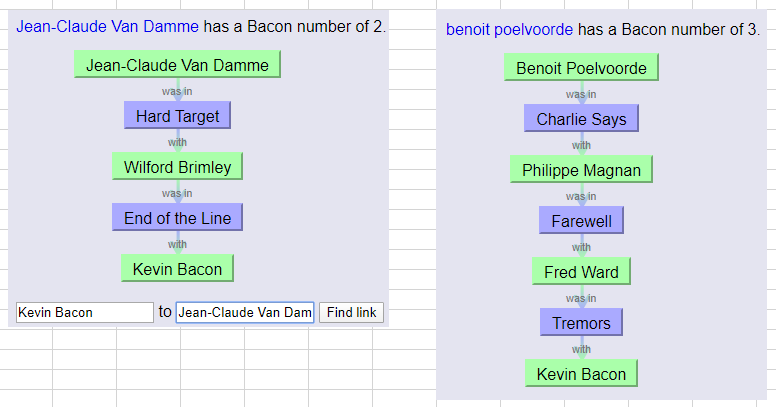

## Idee pour reponse fun

- On pourrait dans chacune de nos reponse mettre un commentaire et dans ce commentaire mettre 1 lettre en Gras et/ou Italique pour faire reference au code Bacon.
- En regroupant ces lettres ca formerait une question qui serait liee au nombre de Kevin Bacon, en considerant des acteurs belges :)
- La concatenation de ces acteurs (reponse a la question), serait la clef Vigenere pour decrypter le commentaire final 
- Pour etre sure qu ils voient qu il y a une reponse cachee, il faudrait mettre un texte dans le commentaire final en ROT Cesar 13 par example: "DHRY RFG YR PBZZRAGNVER FRPERG?"

## Example de degre de Bacon

## proposition

- Dans le commentaire final:
blabla de JS...
Nous avons pris énormément de plaisirs à tenter de résoudre vos énigmes. Les mots nous manquent tellement nous avons trouver vos énigmes très bien équilibrées, ni trop évidentes, ni trop tordues.
Comme le veut l'adage, il vaut mieux une bonne énigme qu'un long discours. WPIQ=2, Cbryibbeg=3 rfg y'vaqvpr qr abger ravtzr cbhe nhgnag dhr ibhf ra nlrm orfbva...**

ca devrait les aiguiller sur la methode de décodage de notre message crypté ds les commentaires de chaque täche. On selectionnerait des lettres en gras et en italique pour former une lettre en Bacon par täche.

AAAAB BAAAA AAAAA BAABB ABBAB BAABB ABAAA BAABB AABAA ABABB AABAA ABBAA BAABA ABABA AABAA ABBBA BAABB 
BABBB BABBB ABABA AABAA AAABB AABAA ABABB AABAA BAAAA AAABA ABAAA AAAAA BAABB ABBAB BAABB BAAAB

"BRAVO VIVEMENT LE PUZZLE DE 2020 MERCI A VOUS"
